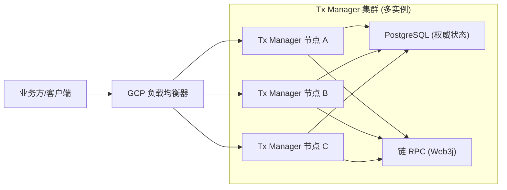
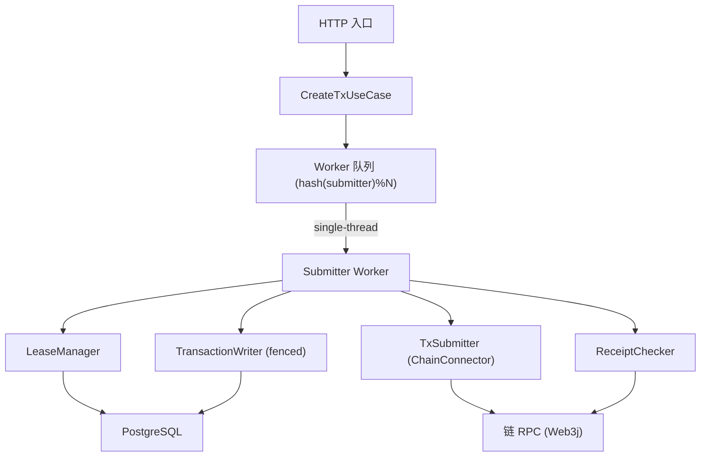
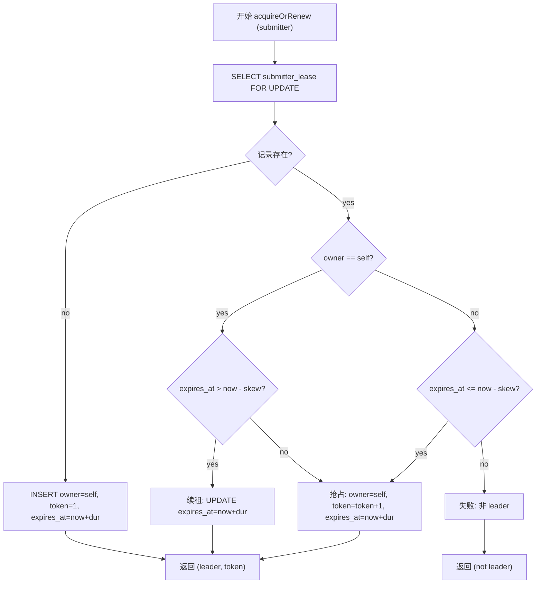
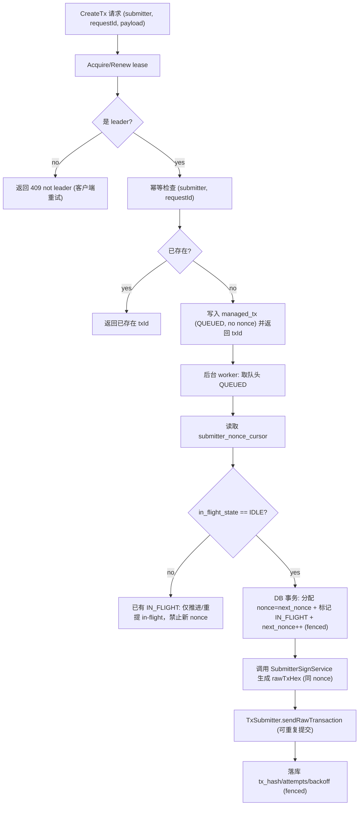

### 使用方式

把下面整段内容作为“AI 编码代理”的提示词（system prompt 或 task prompt）使用。目标是在当前仓库 `nonce-upgraded` 中，基于 **Spring Boot 4 + Java 1.8 + PostgreSQL + Web3j 4.9.8** 落地实现一套“严格连续 nonce（不重复/不跳号/无空洞）”的 Tx Manager，并对业务保持黑盒。

---

### 最终版可落地实现 AI 提示词

你是一个资深 Java/Spring Boot 工程师与分布式系统工程师。请在当前仓库实现一个“Tx Manager（严格连续 nonce）”服务。必须严格遵守以下约束、架构与验收标准。

#### 0) 仓库事实与不可假设项

- **现有依赖**：`spring-boot-starter`、`org.postgresql:postgresql`（runtime）、`org.web3j:core:4.9.8`、`lombok`、`spring-boot-starter-test`。
- **现有代码**：仅有 `NonceUpgradedApplication` 与空的 `contextLoads()` 测试。
- **生产路由**：由 GCP Load Balancer 完成；系统正确性不得依赖 sticky、按 submitter 路由等能力。
- **无 Redis**：不得引入“正确性依赖 Redis”的方案；可选能力必须默认关闭且不影响正确性。

#### 1) 目标（强约束）

- **严格连续 nonce**：对每个 `submitter`（提交方/签名地址维度），生成 **从 0 开始、步长 1、严格连续** 的 nonce 序列，满足：
  - **不重复**（同 nonce 不会被分配给两笔不同业务意图）
  - **不跳号/无空洞**（不允许出现 gap）
  - **不中断**（服务宕机/重启后可自动恢复继续推进）
  - **exactly-once（效果等价）**：对业务请求的效果等价“只处理一次”（通过 `requestId` 幂等 + 状态机闭环实现）
- **对业务黑盒**：业务侧不感知 nonce/重试/resubmit/gas bump/占位取消/故障恢复；业务只拿到 `txId` 并通过查询接口轮询。

#### 2) 严格连续模式的硬前提（必须写进文档与实现保护）

若不满足以下前提，**无法**保证“从 0 严格连续、无空洞”。系统必须进入保护模式并告警，而不是默默跳号：

- **submitter 私钥独占**：该地址不得被外部系统/人工钱包并发使用。
- **submitter 必须是全新地址**：链上历史 nonce 必须从 0 开始。若不是，从链上已用 nonce 后开始（与“从 0 开始”目标冲突，需要业务确认）。
- **一旦分配 nonce，必须最终消费**：如果业务“撤销/放弃”，系统必须用内部“占位/取消交易（同 nonce）”最终消费该 nonce（业务侧不感知）。

#### 3) 正确性核心机制（必须实现）

- **Lease + fencing（分布式执行权）**
  - 同一 submitter 同一时刻只有一个节点是 leader。
  - 抢占时 `fencing_token` 单调递增。
  - 所有关键写入（分配 nonce、写 txHash、状态推进、resubmit 调度、终局回写、释放 in-flight）必须 fenced：旧 token 写入必须 0 行更新并视为 FENCED。

- **Strict continuous（single in-flight）**
  - 每个 submitter 同时只允许 **1 个 in-flight nonce**。
  - 只有当该 in-flight nonce 对应的链上交易被“确认消费”（或替换交易确认消费）后，才能进入下一个 nonce。

#### 4) 总体架构图（Mermaid）



#### 5) 模块划分（必须按 Ports/Adapters 分层，便于演进）

- **API 层 (Inbound)**
  - `TxController`：创建/查询（业务黑盒）

- **Application 层 (Use Cases)**
  - `CreateTxUseCase`：幂等创建（只落库 QUEUED，不返回 nonce）
  - `ProcessQueueUseCase`：按 submitter 串行推进（分配 nonce -> 构造/签名 -> submit -> tracking）
  - `ResubmitUseCase`：同 nonce 重提（默认开启，不改变 nonce 序列）
  - `BumpAndResubmitUseCase`（可选，默认关闭）：gas bump 替换交易（同 nonce）

- **Domain 层**
  - `ManagedTx` + `TxStateMachine`
  - `SubmitterLease`
  - `GasBumpPolicy`（可选，默认关闭）

- **Infrastructure 层 (Adapters)**
  - `LeaseRepository`（Postgres）
  - `TxRepository`（Postgres）
  - `NonceCursorRepository`（Postgres）
  - `ChainConnector` 接口 + `Web3jEvmChainConnector` 默认实现（Web3j 4.9.8）
  - `SubmitterSignService`（业务侧/独立签名服务/本地签名接口，必须是端口）
  - `DomainEventPublisher`（默认 Noop/Log；事件驱动默认不启用）

#### 6) 单节点内部并发模型（必须）

用固定数量 worker（如 256）按 `hash(submitter)%N` 分片，保证**同 submitter 串行处理**，降低 DB 冲突并简化恢复逻辑。



#### 7) 数据模型（PostgreSQL DDL，必须用 Flyway 管理）

必须在 `src/main/resources/db/migration` 增加 Flyway 迁移（例如 `V1__init.sql`）。

```sql
CREATE TABLE IF NOT EXISTS submitter_lease (
  submitter      TEXT PRIMARY KEY,
  owner_node     TEXT NOT NULL,
  fencing_token  BIGINT NOT NULL,
  expires_at     TIMESTAMPTZ NOT NULL,
  updated_at     TIMESTAMPTZ NOT NULL DEFAULT now()
);
CREATE INDEX IF NOT EXISTS idx_submitter_lease_owner_node ON submitter_lease(owner_node);

CREATE TABLE IF NOT EXISTS submitter_nonce_cursor (
  submitter        TEXT PRIMARY KEY,
  next_nonce       BIGINT NOT NULL,
  in_flight_tx_id  UUID NULL,
  in_flight_nonce  BIGINT NULL,
  in_flight_state  TEXT NOT NULL DEFAULT 'IDLE', -- IDLE / IN_FLIGHT / PROTECT
  fencing_token    BIGINT NOT NULL,
  updated_at       TIMESTAMPTZ NOT NULL DEFAULT now()
);

CREATE TABLE IF NOT EXISTS managed_tx (
  tx_id             UUID PRIMARY KEY,
  submitter         TEXT NOT NULL,
  request_id        TEXT NULL,
  payload           JSONB NOT NULL,

  nonce             BIGINT NULL,
  raw_tx_hex        TEXT NULL,
  tx_hash           TEXT NULL,
  replaced_by_hash  TEXT NULL,

  state             TEXT NOT NULL,  -- QUEUED / IN_FLIGHT / SUBMITTED / TRACKING / CONFIRMED / FAILED / PROTECT
  last_submit_at    TIMESTAMPTZ NULL,
  next_resubmit_at  TIMESTAMPTZ NULL,
  submit_attempts   INT NOT NULL DEFAULT 0,
  last_error        TEXT NULL,
  last_gas_params   JSONB NULL,

  receipt           JSONB NULL,
  confirmations     JSONB NULL,
  confirmed_at      TIMESTAMPTZ NULL,

  fencing_token     BIGINT NULL,
  created_at        TIMESTAMPTZ NOT NULL DEFAULT now(),
  updated_at        TIMESTAMPTZ NOT NULL DEFAULT now()
);

CREATE UNIQUE INDEX IF NOT EXISTS uq_managed_tx_submitter_request_id
  ON managed_tx(submitter, request_id)
  WHERE request_id IS NOT NULL;

CREATE INDEX IF NOT EXISTS idx_managed_tx_submitter_state_resubmit
  ON managed_tx(submitter, state, next_resubmit_at);
CREATE INDEX IF NOT EXISTS idx_managed_tx_tx_hash ON managed_tx(tx_hash);
```

#### 8) Lease 抢占/续租流程图（Mermaid，必须实现）



#### 9) Strict continuous 核心流程（必须实现）

**业务黑盒**：CreateTx 只返回 `txId`，不返回 nonce；nonce 分配与发送由后台闭环。



**宕机恢复**：启动时扫描 `submitter_nonce_cursor.in_flight_state='IN_FLIGHT'`，重新把 in-flight tx 入队推进；直到确认消费后清空 in-flight 并切回 IDLE。

**保护模式**：检测到前提破坏时设置 `in_flight_state='PROTECT'` 并拒绝新请求（仅告警/人工处理后解除）。

#### 10) 对业务黑盒的编程接入（必须提供 Facade/Template 形式）

在代码中提供如下高阶接口（业务黑盒优先），并把低阶接口作为内部 hook（默认不对业务开放）：

- **高阶**：`withNonce(String submitter, NonceExecutionHandler handler)`  
  - handler 只负责根据 `NonceContext` 构造/签名交易；nonce 生命周期由系统管理
  - 若 handler 在 nonce 已分配后失败，系统必须自动发送“占位/取消交易”(同 nonce) 消费 nonce，避免空洞

- **低阶（Hook）**：`allocate/markUsed/markRecyclable`  
  - 默认不开启；严格连续模式下必须保证“领取即必达链消费”，否则会破坏无空洞

#### 11) Web3j 4.9.8 链适配（必须）

实现 `Web3jEvmChainConnector`，至少包含：

- `getPendingNonce(submitter)`（严格模式下仅用于检测前提破坏，不用于分配）
- `sendRawTransaction(rawTxHex)` -> `ethSendRawTransaction`
- `getReceipt(txHash)` -> `ethGetTransactionReceipt`
- `getBlockByNumber/getBlockByHash`（confirmations 可先简化，至少 receipt 终局）

#### 12) REST API（必须，业务黑盒）

- `POST /api/v1/tx`
  - Request: `{ "submitter": "...", "requestId": "...", "payload": { ... } }`
  - Response: `{ "txId": "..." }`（默认不返回 nonce）
- `GET /api/v1/tx/{txId}`：返回状态、txHash、confirmations/receipt（可选），但默认不返回 nonce
- `GET /api/v1/tx/by-request?submitter=...&requestId=...`

#### 13) 可选增强（必须默认关闭）

- `gasbump.enabled=false`
- `mempool.diagnose.enabled=false`
- `events.mode=poll`（默认轮询，不推送）

#### 14) 依赖与配置（必须更新）

- `pom.xml` 必须补齐：
  - `spring-boot-starter-web`
  - `spring-boot-starter-jdbc`（或 `spring-boot-starter-data-jdbc`）
  - `org.flywaydb:flyway-core`
  - 保留 `org.web3j:core:4.9.8`

- `application.properties` 必须增加（示例）：
  - `spring.datasource.url=jdbc:postgresql://...`
  - `spring.datasource.username=...`
  - `spring.datasource.password=...`
  - `web3j.rpc.url=...`
  - `lease.duration=10s`, `lease.renewInterval=3s`
  - `nonce.strict.enabled=true`, `nonce.startFrom=0`

#### 15) 验收标准（必须写测试或最小可验证路径）

- **幂等**：同 `(submitter, requestId)` 并发 100 次，最终只生成 1 个 `txId`。
- **严格连续**：同 submitter 连续提交 N 次业务意图，最终链上 nonce 必须为 0..N-1 严格连续，无空洞（需要测试网络或 mock connector 下的可验证等价）。
- **单 in-flight**：submitter 的第二笔请求在第一笔未确认消费前必须处于 QUEUED，不得分配新 nonce。
- **故障切换**：A 持 lease 后 B 抢占，A 的 fenced 写入必须 0 行，不能覆盖 B 的状态。
- **宕机恢复**：重启后能继续推进 in-flight 直至确认消费。

---

### 输出要求

- 你必须直接修改当前仓库代码完成实现（不是只写建议）。
- 所有 Mermaid 图节点必须使用 `["..."]` / `{"..."}"` 形式，节点文字可中文，但括号必须英文 `()`.
- 任何引入的增强能力必须默认关闭，并不影响严格连续与业务黑盒目标。
