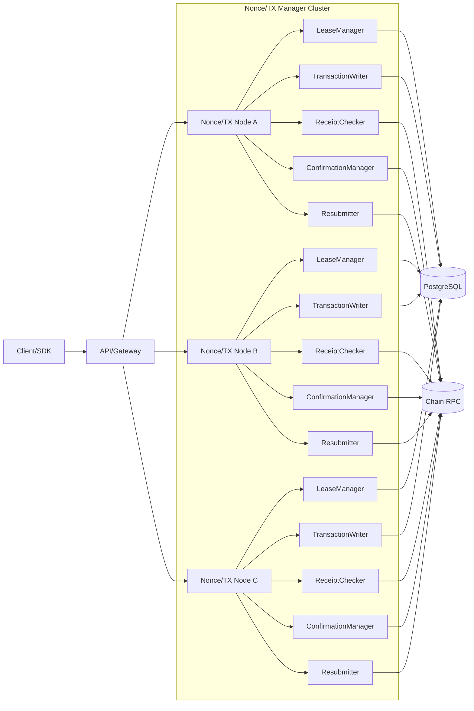
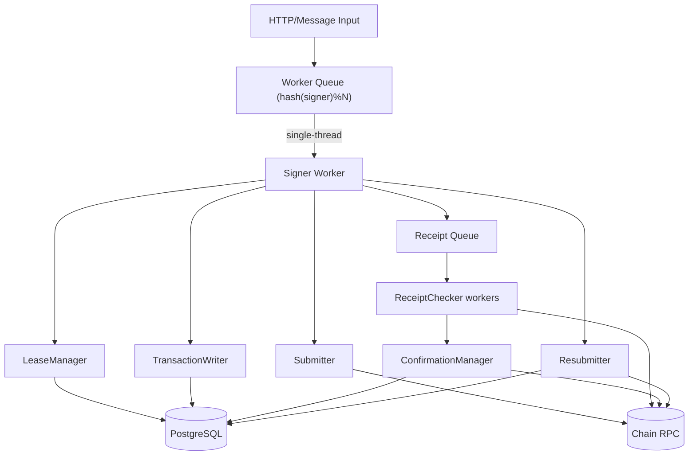
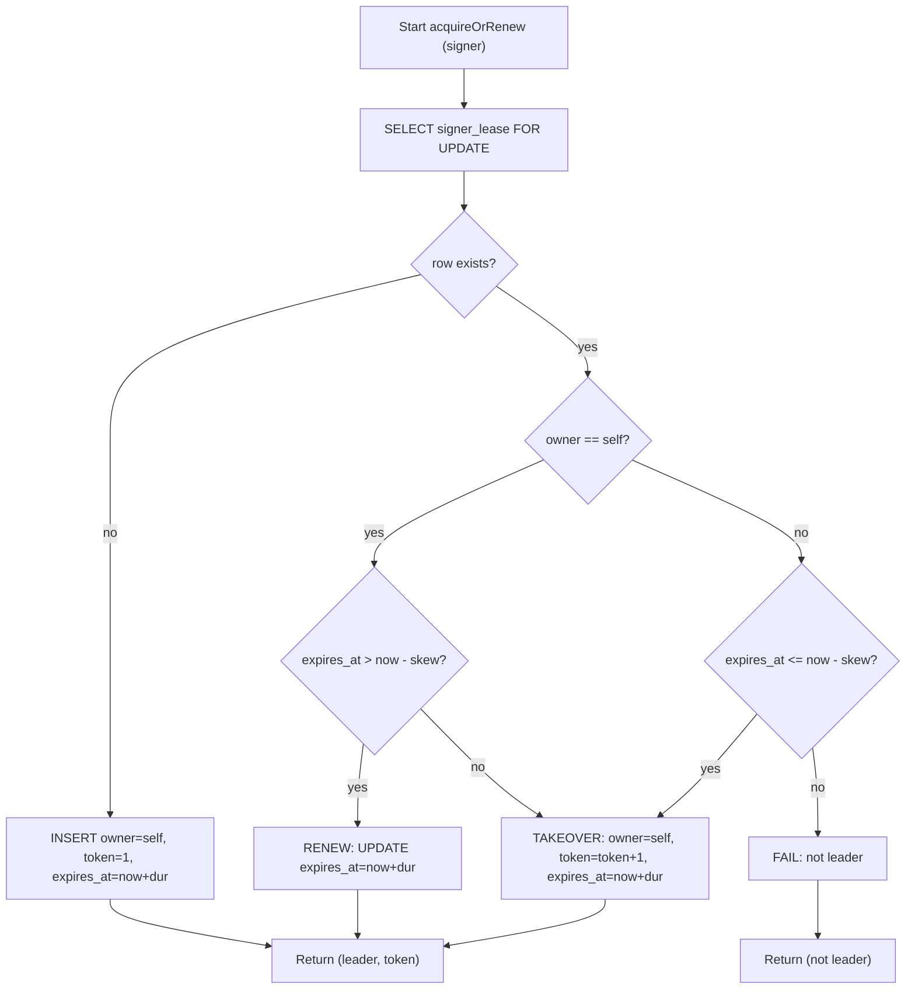
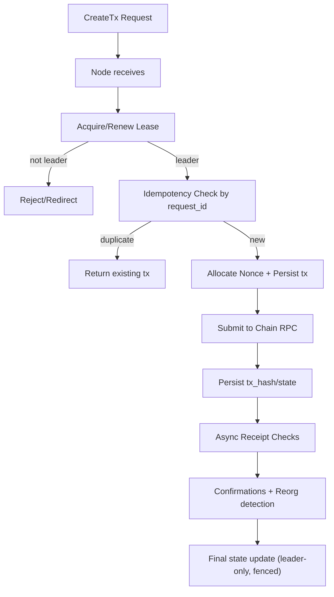
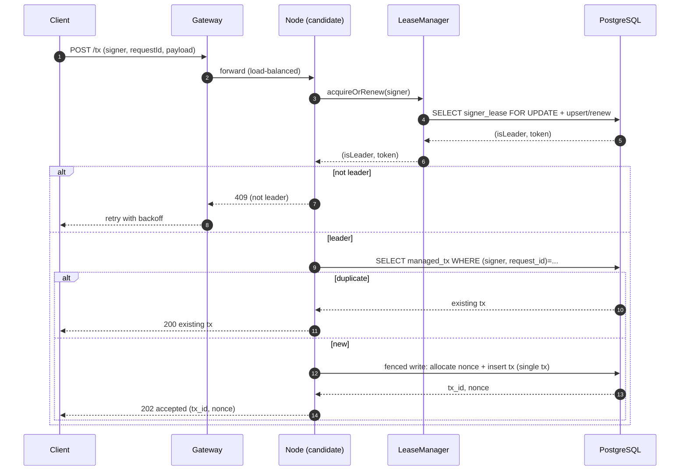
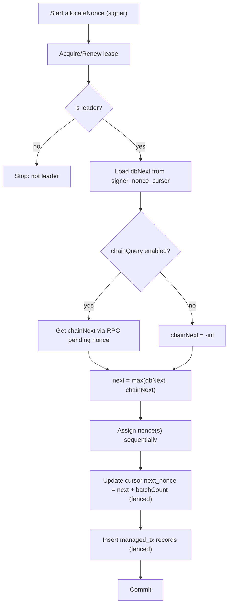
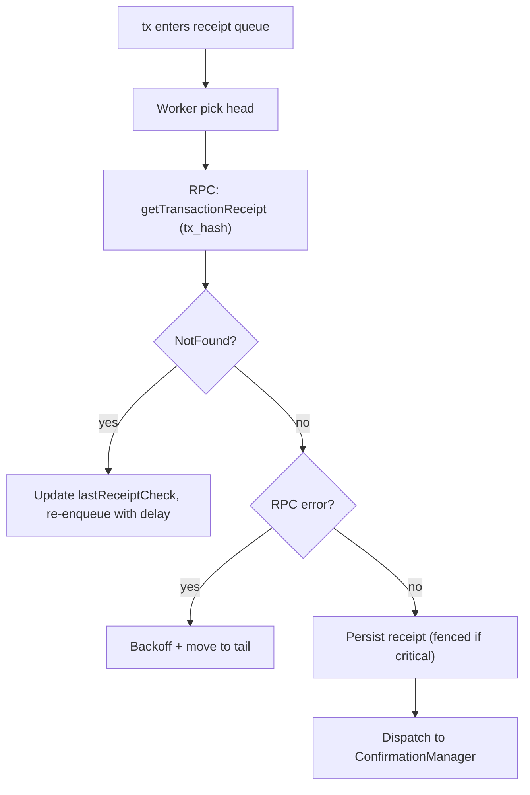
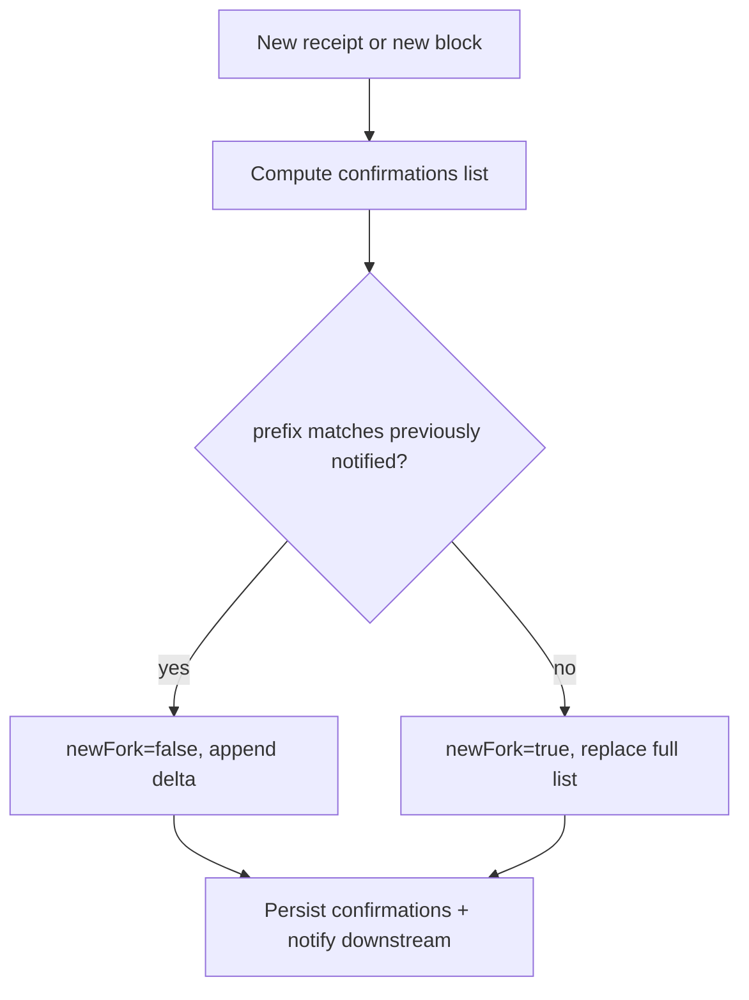
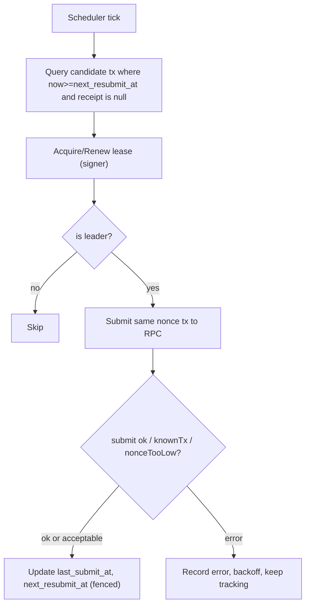
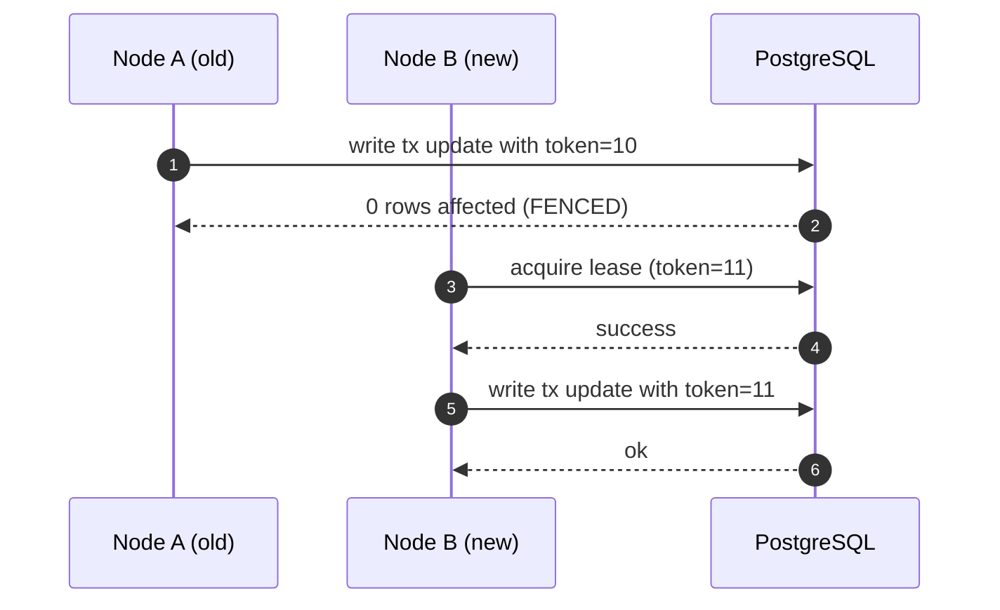

## 1. 文档目标与范围

### 1.1 目标

本详细设计用于在多实例部署下实现 **“同一 signer 在任意时刻只有一个节点拥有执行权”**，从而保证：

- **nonce 分配不重复**（不会双活分配同一 nonce）
- **resubmit 不重复**（不会多节点同时重提同 nonce）
- **终局回写不乱序/不被旧节点覆盖**（reorg/故障切换窗口内仍正确）
- **可扩缩容**：节点内可通过本地串行化/批处理提升吞吐，正确性靠租约+fencing 兜底

该设计参考 `草稿.md` 中“路由分片 + 分布式租约 + fencing”思想，并吸收 FireFly Transaction Manager（FFTM）中“按 signer 串行化 + 状态机 + receipt/confirmations 异步推进”的方法论。

### 1.2 非目标（本期不做/可后续增强）

- Gas bump / 替换交易策略（仅提供扩展点）
- 交易池（mempool）级别诊断与观测（仅提供基础可观测性）
- 多链/多 connector 抽象（先单链单 RPC）

---

## 2. 核心原则（必须满足）

### 2.1 两层保障：性能路由 + 正确性执行权

- **入口流量层（已有）**：生产环境已通过 GCP Load Balancer 进行流量分发；该层不作为正确性依赖
- **执行权层（正确性）**：由“租约 lease + fencing token”决定谁能对该 signer 做关键写入

> 入口流量如何分发不影响正确性；正确性由 lease + fencing 保证。

### 2.2 fencing：硬切断旧节点写入能力

任何关键写入（nonce 分配、写 txHash、状态推进、resubmit 调度、终局回写、confirmations 覆盖等）必须携带 `fencing_token` 并做校验。旧 token 的写入一律拒绝。

---

## 3. 总体架构

### 3.1 组件划分

- **API/Gateway**：接入交易创建/查询等请求（可与服务同进程或独立）
- **Nonce & Tx Manager 节点（多实例）**：
  - `LeaseManager`：租约抢占/续租（强制）
  - `TransactionWriter`：按 signer 串行/批处理写库（强建议）
  - `Submitter`：提交交易到链 RPC（幂等语义）
  - `ReceiptChecker`：异步拉 receipt（NotFound 不阻塞）
  - `ConfirmationManager`：确认数计算、reorg 检测、newFork 语义
  - `Resubmitter`：超时重提同 nonce（leader-only）
- **PostgreSQL（权威状态）**：租约、交易、receipt、confirmations、历史等
- **Chain RPC/Node**：发送交易、查询 receipt、查询区块、查询 nextNonce（可选）

### 3.2 整体执行架构图（Mermaid）



### 3.3 节点内执行架构图（单节点视角）

> 说明：同一节点内部仍可能有多线程并发进入；本设计建议用“固定 worker 分片 + 单线程消费”把同一 signer 的关键操作串行化。



---

## 4. 数据模型（PostgreSQL）

> 说明：本仓库当前仅引入 `org.postgresql:postgresql`，因此本设计以 Postgres 为权威状态存储。若后续引入 Redis，可将“缓存/队列/调度索引”迁移到 Redis，但 lease 与 fencing 的权威判定仍建议落在 Postgres（或用 Redis + Lua + fencing 版本号实现同等约束）。

### 4.1 signer 租约表（强制）

表：`signer_lease`

| 字段 | 类型 | 说明 |
|---|---|---|
| signer | text PK | signer 唯一标识（地址/账户） |
| owner_node | text | 当前持有租约的节点 ID |
| fencing_token | bigint | 抢占时自增的栅栏号（单调递增） |
| expires_at | timestamptz | 租约过期时间 |
| updated_at | timestamptz | 更新时间 |

约束与索引：
- `PRIMARY KEY (signer)`
- 可加 `INDEX (owner_node)` 便于观测

#### 4.1.1 DDL（示例，可直接执行）

```sql
CREATE TABLE IF NOT EXISTS signer_lease (
  signer         TEXT PRIMARY KEY,
  owner_node     TEXT NOT NULL,
  fencing_token  BIGINT NOT NULL,
  expires_at     TIMESTAMPTZ NOT NULL,
  updated_at     TIMESTAMPTZ NOT NULL DEFAULT now()
);

CREATE INDEX IF NOT EXISTS idx_signer_lease_owner_node ON signer_lease(owner_node);
```

### 4.2 交易表（建议：交易即 nonce 载体）

表：`managed_tx`

| 字段 | 类型 | 说明 |
|---|---|---|
| tx_id | uuid PK | 交易 ID |
| signer | text | signer |
| request_id | text | 外部幂等键（可空但强建议） |
| nonce | bigint | 分配的 nonce（分配后不可变） |
| payload | jsonb | 交易原始参数（to/data/value/gas 等） |
| tx_hash | text | 提交后的哈希（可空） |
| state | text | 状态机：`CREATED/ALLOCATED/SUBMITTED/TRACKING/CONFIRMED/FAILED` |
| sub_state | text | 子状态：`PENDING/STALE/...`（按需） |
| last_submit_at | timestamptz | 上次提交时间 |
| next_resubmit_at | timestamptz | 下次允许 resubmit 时间（防重复调度） |
| receipt | jsonb | receipt（可空） |
| confirmations | jsonb | confirmations 列表（或拆表） |
| confirmed_at | timestamptz | 达到阈值的时间 |
| fencing_token | bigint | 写入该记录时使用的 token（用于审计与冲突检测） |
| created_at / updated_at | timestamptz | 审计字段 |

关键索引：
- `UNIQUE (signer, request_id)`（若 request_id 不为空）
- `INDEX (signer, state, next_resubmit_at)`
- `INDEX (tx_hash)`

### 4.3 signer nonce 游标（建议）

表：`signer_nonce_cursor`

| 字段 | 类型 | 说明 |
|---|---|---|
| signer | text PK | signer |
| next_nonce | bigint | 本系统“将要分配”的下一个 nonce（权威/近权威） |
| updated_at | timestamptz | 更新时间 |
| fencing_token | bigint | 最后更新的 token |

> 说明：如果你坚持“nonce allocation 独立表”（RESERVED/USED/RECYCLABLE），也可以替换本表；但推荐与交易绑定，降低状态分裂。

#### 4.3.1 DDL（示例，可直接执行）

```sql
CREATE TABLE IF NOT EXISTS signer_nonce_cursor (
  signer        TEXT PRIMARY KEY,
  next_nonce    BIGINT NOT NULL,
  fencing_token BIGINT NOT NULL,
  updated_at    TIMESTAMPTZ NOT NULL DEFAULT now()
);
```

---

## 5. 租约与 fencing 机制（关键）

### 5.1 节点标识

每个节点生成稳定的 `node_id`（建议：`{env}-{region}-{podName}-{instanceId}`），用于：
- `signer_lease.owner_node`
- 日志与指标标签

### 5.2 租约参数

- `lease_duration`: 10s（建议 5–30s）
- `renew_interval`: 3s（小于 duration/2）
- `clock_skew_allowance`: 1s（用于判断过期的保守偏移）

### 5.3 抢占/续租算法（Postgres 事务 + 行级锁）

目标：对同一 signer，在 DB 上形成“单主”。

伪代码（概念）：

1) `BEGIN`
2) `SELECT * FROM signer_lease WHERE signer = ? FOR UPDATE`
3) 分支：
   - **不存在**：插入 `owner_node=self`，`fencing_token=1`，`expires_at=now()+duration`
   - **存在且 owner=self 且未过期**：续租：只更新 `expires_at`
   - **存在但已过期**：抢占：`owner_node=self` 且 `fencing_token=fencing_token+1` 且更新 `expires_at`
   - **存在且未过期且 owner!=self**：失败，返回“非 leader”
4) `COMMIT`

返回：`(isLeader, fencing_token, expires_at)`

> 抢占时 fencing_token 必须单调递增；旧 owner 即使还在跑，也会因为 token 过期而被硬切断写入权。

#### 5.3.1 抢租/续租流程图



### 5.4 fencing 校验规则（强制）

所有关键写必须满足：

- 写入 SQL 形如：
  - `... WHERE signer = :signer AND :token = (SELECT fencing_token FROM signer_lease WHERE signer=:signer AND owner_node=:self AND expires_at > now())`
  - 或者在同一事务内先锁 lease 行并校验 `owner_node/expires_at/token` 再执行写入

任何写入若校验失败（影响行数为 0）：
- 视为 **FENCED**（被栅栏拒绝）
- 立即停止该 signer 的处理、释放本地队列、等待下一次抢租/下一次请求触发

#### 5.4.1 fenced UPDATE 模板（示例）

> 目标：让“只有当前 leader 且 lease 未过期且 token 匹配”的写入生效；否则 0 行更新并视为 FENCED。

```sql
UPDATE managed_tx
SET state = :new_state,
    updated_at = now(),
    fencing_token = :token
WHERE tx_id = :tx_id
  AND signer = :signer
  AND EXISTS (
    SELECT 1
    FROM signer_lease sl
    WHERE sl.signer = :signer
      AND sl.owner_node = :node_id
      AND sl.expires_at > now()
      AND sl.fencing_token = :token
  );
```

---

## 6. 节点内并发控制（强建议）

同一节点内仍可能并发进入同 signer（例如多个 HTTP 线程），需要本地串行：

- 方案 A：`ConcurrentHashMap<signer, SingleThreadExecutor>`（简单但易膨胀）
- 方案 B：固定数量 worker（例如 256 个），`workerIndex=hash(signer)%N`，每个 worker 单线程消费队列（推荐）

> 这与 FFTM 的 “按 signer 分配到固定 writer worker” 同构：减少 DB 竞争、便于批处理。

---

## 7. 核心流程设计（含流程图/时序图）

### 7.1 流程总览



### 7.2 创建交易（幂等 + leader-only nonce 分配）

#### 7.2.1 时序图



#### 7.2.2 关键点（可直接落地的实现约束）

- **必须先抢租**：任何进入 nonce 分配路径前都先 `acquireOrRenewLease(signer)`
- **幂等检查两次**：
  - 第一次：API 入口快速查 `UNIQUE (signer, request_id)`
  - 第二次：真正写入前在同一事务内再校验（防并发窗口）
- **分配 nonce 与插入交易必须在一个事务内完成**（否则会出现“分配了但没写入”）

### 7.3 Nonce 分配策略（max(chain, db/cache)）

> 若 signer 私钥可能被外部系统使用，必须定期参考链上 nextNonce；否则可主要依赖本地游标提升性能。

计算规则：

1) `dbNext = signer_nonce_cursor.next_nonce`（若无则初始化）
2) `chainNext = eth_getTransactionCount(signer, "pending")`（可配置启用）
3) `next = max(dbNext, chainNext)`
4) 分配本批交易的 nonce：从 `next` 连续递增
5) 更新 `signer_nonce_cursor.next_nonce = next + batchCount`

缓存规则（可选）：
- 允许节点内缓存 `next_nonce`，但 **缓存递增后若 DB 事务失败必须清理缓存**（避免跳号/错号）

#### 7.3.1 Nonce 分配（leader-only）流程图



#### 7.3.2 事务建议（强制）

- **同一事务**内完成：
  - 幂等二次校验
  - 游标更新
  - 交易插入（绑定 nonce）
  - 任何失败 => 整体回滚（并清理本地 nonce 缓存）

### 7.4 提交交易（submit）与“已知交易”幂等语义

关键语义（参考 FFTM）：

- Submit 成功：写入 `tx_hash`，状态进入 `TRACKING`
- Submit 失败但错误属于：
  - `known_transaction`
  - `nonce_too_low`
  则：
  - 若本地已有 `tx_hash`：视为成功（重复提交幂等）
  - 若本地没有 `tx_hash`：返回错误（灰区，需要 connector 支持“重算预期 txHash”或链上对账补齐）

### 7.5 receipt 异步拉取（不阻塞主路径）

设计要点（参考 FFTM receiptChecker）：

- receipt 查询采用后台 worker 池
- 队列为“无界/可控无界”（至少避免队头阻塞）
- `NotFound` 不视为错误，只更新时间戳并稍后再查
- 非 NotFound 错误：指数退避，把条目放回队尾

#### 7.5.1 ReceiptChecker 流程图



### 7.6 confirmations 计算 + reorg 检测 + newFork 语义

终局判定：达到 `requiredConfirmations`（或 SAFE/FINALIZED 策略）

链视图一致性：
- 在一次计算循环中，对同一高度的区块哈希必须保持一致（缓存 `getBlockByNumber` 结果）

newFork 协议：
- 比较本次计算的 confirmations 与上次已通知的 confirmations
- 若前缀 hash 序列不一致，`newFork=true`，下游必须 **全量覆盖** confirmations
- 若一致，仅增量追加

#### 7.6.1 confirmations/newFork 决策图



### 7.7 resubmit（同 nonce 重提，leader-only）

触发条件：

- `now() - last_submit_at > resubmit_interval`
- 且 `receipt` 仍为空（或未达到终局）
- 且 `now() >= next_resubmit_at`（防重复调度）

执行约束：
- resubmit 前必须验证 lease + fencing
- 调度写库：`UPDATE managed_tx SET next_resubmit_at=now()+resubmit_interval ...` 必须 fenced

#### 7.7.1 Resubmitter 流程图



---

## 8. 故障与竞态场景（必须覆盖）

### 8.1 故障转移窗口（旧节点仍在跑但路由已切走）

目标：旧节点不得再写入关键状态。

流程（关键步骤）：

1) 节点 A 持有 lease(token=10)
2) 流量逐步切到节点 B（例如 LB/扩缩容导致），B 抢占 lease(token=11)
3) A 仍在处理一些旧请求，尝试写入：
   - 因为写入必须校验 token=10，DB 拒绝（0 行更新）=> A 被 fenced
4) 只有 B 能继续推进状态



### 8.2 网络分区/脑裂（两边都以为自己负责 signer）

要点：路由与节点自认为“负责”没有意义，最终看 DB 的 lease。

- 若两边都能访问 DB：只有一边能拿到行锁并续租/抢占成功
- 若一边无法访问 DB：无法续租 => lease 过期后自动失权；即使继续跑也会被 fenced（写入失败）

### 8.3 进程崩溃/重启

- lease 过期后由其他节点抢占
- 重启后本节点会重新参与抢占，但必须以最新 token 写入
- nonce 游标策略建议：
  - `nonce_state_timeout` 到期后更频繁参考链上 `pending nonce`

---

## 9. API 设计（建议）

> 这里给出可执行的接口草案，便于直接落地到 Spring Boot Controller。

### 9.1 创建交易

- `POST /api/v1/tx`
- Request：
  - `signer`（必填）
  - `requestId`（强建议必填，用于幂等）
  - `payload`（交易参数）
- Response：
  - `txId`
  - `nonce`
  - `state`

返回码建议：
- `202`：创建成功（已持久化/已分配 nonce）
- `200`：幂等命中（返回已存在交易）
- `409`：not leader（建议客户端重试或按 redirect header 重新路由）

### 9.2 查询交易

- `GET /api/v1/tx/{txId}`
- `GET /api/v1/tx/by-request?signer=...&requestId=...`

---

## 10. 配置项（建议补齐到 application.properties）

### 10.1 租约

- `nonce.lease.duration=10s`
- `nonce.lease.renewInterval=3s`

### 10.2 nonce 策略

- `nonce.chainQuery.enabled=true`
- `nonce.chainQuery.mode=pending`（或 latest）
- `nonce.nonceStateTimeout=30s`（越小越保守，越频繁参考链上）

### 10.3 resubmit

- `tx.resubmit.enabled=true`
- `tx.resubmit.interval=60s`
- `tx.resubmit.maxAttempts=0`（0 表示无限，或给上限）

### 10.4 confirmations

- `confirmations.required=20`
- `confirmations.staleReceiptTimeout=60s`
- `confirmations.receiptWorkers=10`
- `confirmations.fetchReceiptUponEntry=false`

---

## 11. 可观测性（最低要求）

- **日志**：每条关键写入输出 `signer/txId/nodeId/token`
- **指标**：
  - `lease_acquire_success_total{signer?}`（signer 建议做采样/脱敏）
  - `lease_fenced_total`
  - `tx_submit_total{result}`
  - `receipt_check_total{result}`
  - `confirmations_newFork_total`
- **告警**：
  - fenced 激增
  - receipt backlog 增长
  - resubmit 频率异常

---

## 12. 工程落地建议（对应当前 Spring Boot 项目）

### 12.1 包结构建议

- `com.work.nonce.upgraded.lease`：LeaseManager、LeaseRepository
- `com.work.nonce.upgraded.tx`：TxController、TxService、TransactionWriter
- `com.work.nonce.upgraded.chain`：ChainClient（RPC 适配）
- `com.work.nonce.upgraded.confirmations`：ReceiptChecker、ConfirmationManager
- `com.work.nonce.upgraded.resubmit`：Resubmitter

### 12.2 事务边界建议

- acquire/renew lease：单独事务（短、少锁）
- nonce 分配 + tx 插入 + cursor 更新：单事务（强一致）
- 写 tx_hash / 状态推进 / resubmit 调度 / 终局回写：均 fenced，且尽量短事务

---

## 13. 测试用例清单（验收标准）

### 13.1 正常路径

- 单 signer 并发 1000 创建交易：nonce 严格递增无重复
- 多 signer 并发：吞吐随节点数线性提升（瓶颈主要来自 DB/RPC/worker 并发度）

### 13.2 幂等

- 相同 `(signer, requestId)` 并发 100 次：只生成 1 条交易记录

### 13.3 双活窗口（关键）

- 模拟节点 A 先持 lease，随后节点 B 抢占；A 继续尝试写：
  - A 的关键写全部失败（0 行更新）并记录 fenced
  - B 能继续推进状态到终局

### 13.4 reorg/newFork

- 构造 confirmations 前缀不一致：下游收到 `newFork=true` 且 confirmations 被全量覆盖

---

