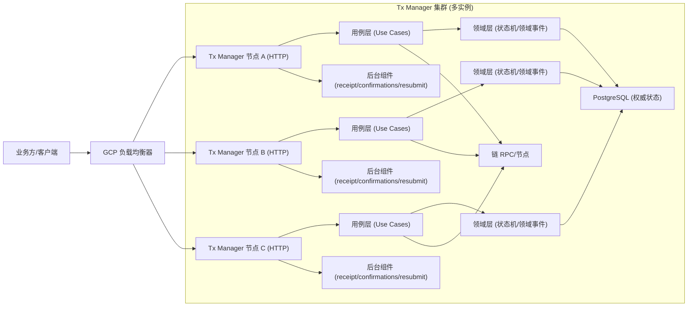
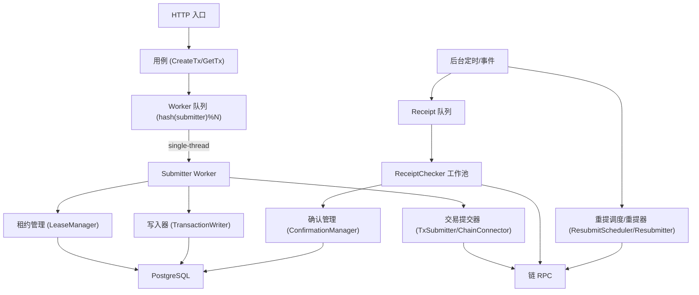
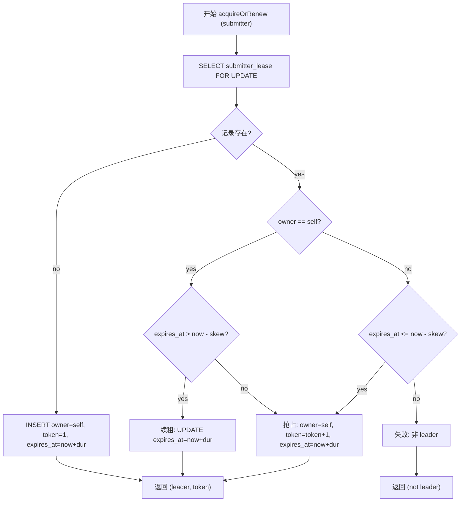
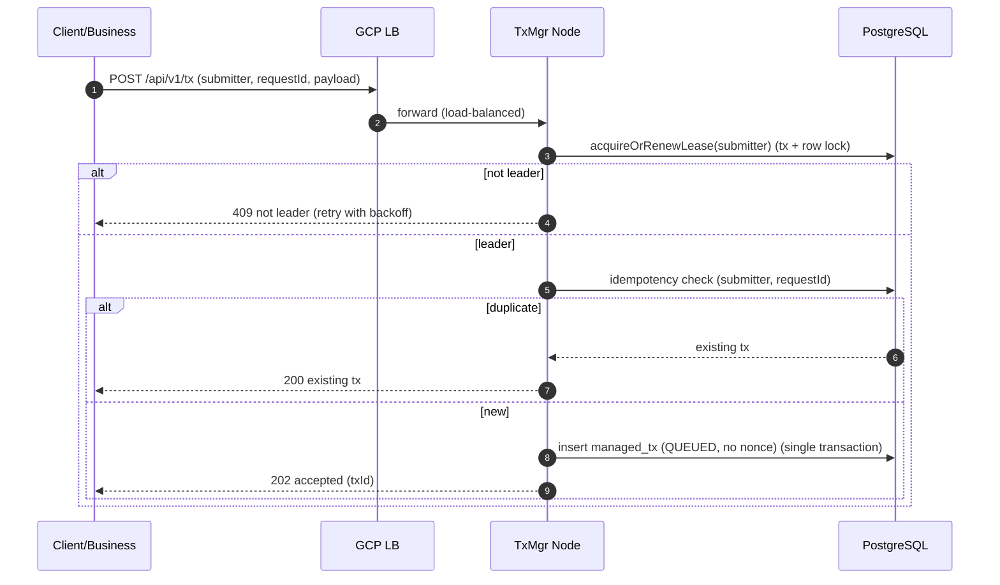
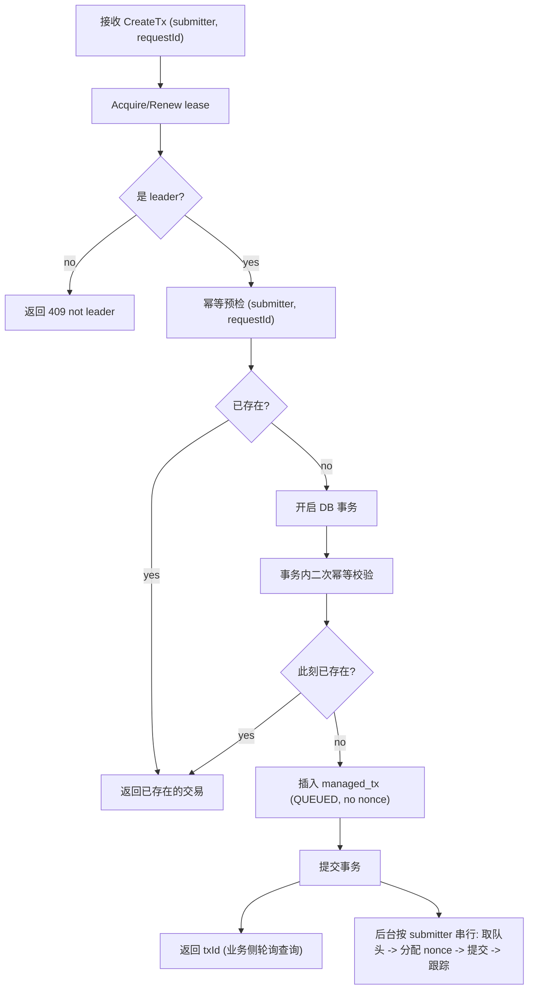
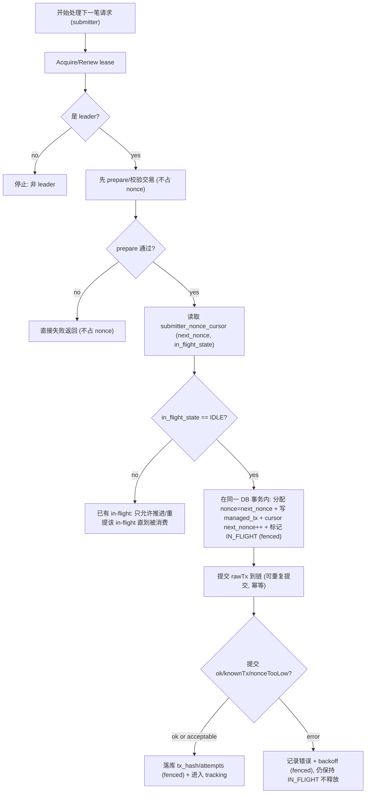
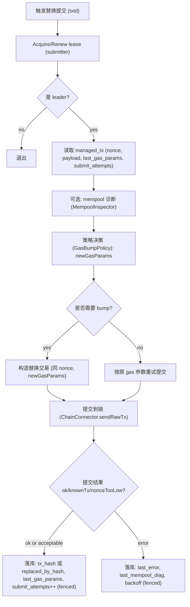
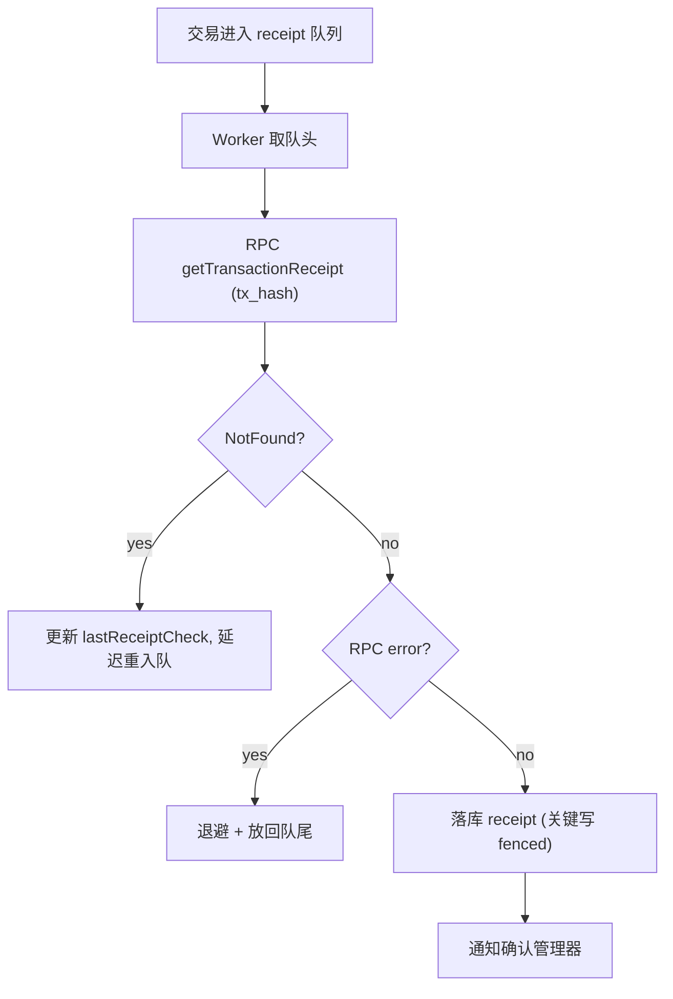
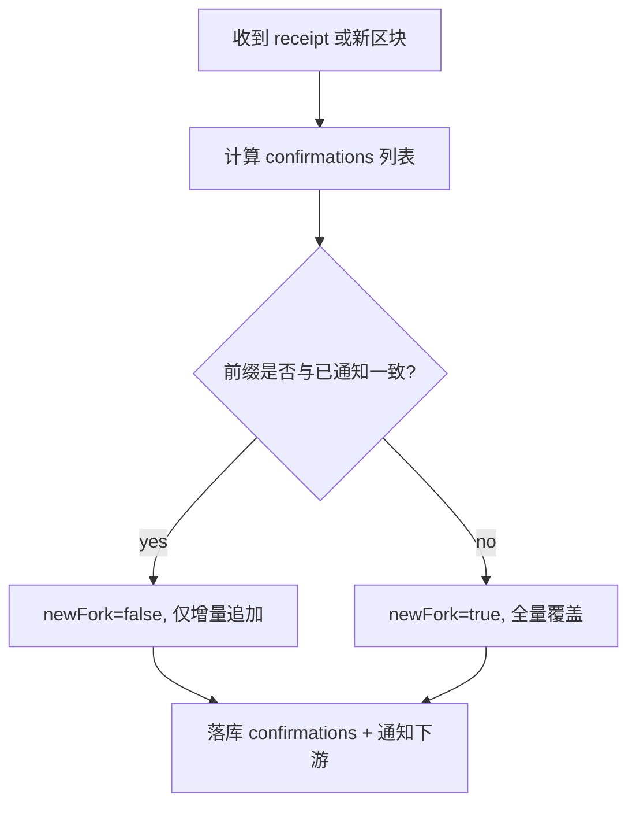
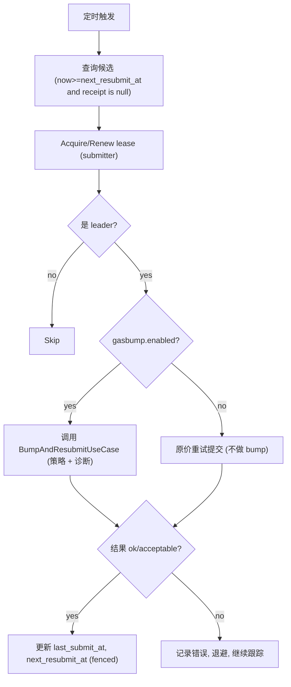

## 1. 目标与原则

### 1.1 目标

在多实例部署 (GCP Load Balancer 负责流量分发) 的前提下，为同一 submitter 提供 **全局串行化的执行权**，实现如下强约束目标：

- 在多节点 Java 服务中，为每个 **submitter** (提交方/签名地址维度) 生成 **从 0 开始、步长 1、严格连续** 的 nonce，并满足 **不重复、不跳号、不出现空洞**、**宕机自动恢复**、对业务接口 **黑盒且稳定**，并实现工程可控的 **exactly-once (效果等价)** 语义
- **终局回写不被旧节点覆盖** (fencing 硬切断旧 owner 写入能力)
- **易维护、可独立演进**：与实际业务尽可能解耦，链/RPC/策略可插拔

### 1.1.1 严格连续模式的硬性前提（不满足则无法保证“不跳号/无空洞”）

为保证“严格连续、无空洞”，必须满足以下前提；否则任何实现只能做到“不重复/不回退”，无法保证“永不跳号”：

- **submitter 私钥独占**：同一 submitter 不能被外部系统/人工钱包/脚本同时使用；否则链上 nonce 会被外部消费，系统只能前跳
- **submitter 地址为全新地址**：链上历史 nonce 必须从 0 开始；若该地址已发过交易，则“从 0 开始”不成立（只能从链上已用 nonce 之后开始）
- **一旦分配 nonce，就必须保证最终被链消费**：分配后的业务请求不允许出现“占了 nonce 但最终不发链上交易”的情况；即使业务侧发起取消/超时放弃，Tx Manager 内部也必须通过“占位/取消交易”(同 nonce) 去消费该 nonce（业务侧不感知 nonce 与占位细节）

> 约束：若检测到前提被破坏（例如链上 pending nonce 超出本地序列），系统必须进入保护模式：停止该 submitter 的新请求并告警，而不是默默跳号。

### 1.2 核心原则（必须满足）

- **正确性只依赖“执行权层”**：GCP LB 的路由/粘性/重试不作为正确性依赖
- **同 submitter 的关键写入必须 leader-only**：nonce 分配、状态推进、resubmit 调度、receipt/confirmations 的“最终回写”
- **fencing token 是硬约束**：所有关键写入必须携带 `fencing_token` 校验；旧 token 写入一律失败
- **异步推进终局**：提交与终局解耦；receipt/confirmations 由后台组件推进
- **对业务黑盒**：业务侧不感知 nonce/重试/resubmit/gas bump/占位取消/故障恢复；业务只关心“提交意图是否被接收(txId) + 最终结果状态”，并通过查询接口获取状态

### 1.3 增强功能（纳入本设计，默认关闭，可手动开启）

> 说明：这三项能力都以“接口 + 默认实现”的方式落地，保证核心 nonce/lease/fencing 逻辑不被耦合，后续可以独立演进和持续增强。默认不启用，避免在早期引入额外复杂度；当出现链拥堵、费率波动、节点不稳定或需要扩链时再开启。

- **Gas bump/替换交易策略 (策略接口 + 默认简单实现)**
  - **场景**：链拥堵、费率估算偏低、交易长期 pending
  - **作用**：同 nonce 交易长时间未确认时，用更高费率参数构造替换交易并提交，加速上链
  - **防止**：交易长期 pending 导致业务超时、重试风暴、nonce 阻塞后续交易
  - **默认**：关闭；开启后才允许同 nonce 的替换提交

- **Mempool 诊断 (基础观测 + 保守重试)**
  - **场景**：RPC/节点抖动，receipt 长时间查不到，怀疑交易丢失或被替换
  - **作用**：输出“可能在 mempool/可能丢失/可能已被替换”等诊断信号，指导是否 resubmit 或 bump
  - **防止**：把“查不到 receipt”误判成失败或成功，导致错误回收 nonce、重复提交或紧密自旋重试
  - **默认**：关闭；开启后才会做诊断采集与输出

- **多链多协议统一 (先抽象接口，默认实现先支持 EVM)**
  - **场景**：未来接入不同链或不同 connector (EVM/L2/联盟链/自研协议)
  - **作用**：把提交/查 nonce/查 receipt/查区块等链交互抽象成 `ChainConnector`，核心逻辑保持不变
  - **防止**：核心逻辑被某条链细节绑死，扩链时大改引入回归风险
  - **默认**：接口常驻；除 EVM 外的其它实现按需启用

---

## 2. 总体架构（模块划分清晰、易维护）

### 2.1 分层与模块（推荐的工程结构）

为避免与具体业务强耦合，采用清晰分层 (可类比 Clean Architecture)：

- **API 层 (Inbound)**
  - `TxController`：接收创建/查询请求
  - `AdminController`：健康检查、调试端点 (可选)

- **应用层 (Application / Use Cases)**
  - `CreateTxUseCase`：幂等创建、触发分配与提交
  - `GetTxUseCase`：查询
  - `ResubmitScheduler`：扫描待重提交易并触发重提 (leader-only)
  - `BumpAndResubmitUseCase`：根据策略与诊断决定“原价重发/替换交易 (gas bump)”并提交 (leader-only)
  - **约束**：应用层只依赖“端口接口 (Ports)”，不直接依赖 Web3j/HTTP SDK/消息中间件

- **领域层 (Domain)**
  - `ManagedTx`：交易聚合根 (nonce、txHash、state)
  - `SubmitterLease`：租约与 fencing 语义
  - `TxStateMachine`：状态机 (Created/Allocated/Tracking/Confirmed/Failed)
  - `DomainEvent`：领域事件 (TxCreated/TxSubmitted/TxReceiptUpdated/TxConfirmed 等)
  - `GasBumpPolicy`：费率/替换策略接口 (可插拔)
  - `MempoolDiagnostic`：诊断结果模型（仅用于决策与观测，不作为正确性依赖）
  - **约束**：领域层不引用任何基础设施实现 (不 import Web3j/JDBC/HTTP Client)

- **基础设施层 (Infrastructure / Outbound Adapters)**
  - `LeaseRepository`：PostgreSQL 实现
  - `TxRepository`：PostgreSQL 实现
  - `NonceCursorRepository`：PostgreSQL 实现
  - `ChainConnector`：链交互适配 (接口 + 默认实现先支持 EVM)
  - `Web3jEvmChainConnector`：基于 Web3j 的 EVM 默认实现 (org.web3j:core:4.9.8)
  - `MempoolInspector`：mempool 诊断适配 (接口 + 默认简单实现)
  - `ReceiptChecker`：后台 worker 拉 receipt
  - `ConfirmationManager`：确认数与 reorg/newFork 处理
  - `DomainEventPublisher`：领域事件发布适配 (Webhook/Kafka/PubSub/日志)
  - `SubmitterSignService`：签名适配 (业务侧/独立 submitter 签名服务/本地签名)

> 业务侧只需要关心“提交交易请求/消费终局结果”，其余全由 Tx Manager 自演进。

### 2.2 整体执行架构图（Mermaid）



### 2.3 单节点内部执行架构（并发控制与可维护性）



### 2.4 七大设计原则对照（结论：整体符合，少量约束需明确执行）

> 七大设计原则：单一职责、开闭、里氏替换、依赖倒置、接口隔离、迪米特法则、合成复用。

- **单一职责原则 (SRP)**
  - **落地**：`LeaseManager` 只负责执行权；`TransactionWriter` 只负责 fenced 写库；`ReceiptChecker` 只拉取 receipt；`ConfirmationManager` 只做 confirmations/reorg；`GasBumpPolicy` 只决策费率参数。
  - **约束**：不要把“链调用 + DB 写入 + 状态机推进 + 业务回调”塞进一个类/一个事务。

- **开闭原则 (OCP)**
  - **落地**：通过 `GasBumpPolicy`、`MempoolInspector`、`DomainEventPublisher`、`SubmitterSignService`、`ChainConnector` 等端口扩展能力；核心状态机与 fenced 规则不改。
  - **收益**：新增策略/新增下游推送方式/新增链实现，不改核心流程代码。

- **里氏替换原则 (LSP)**
  - **落地**：任意 `ChainConnector` 实现 (Web3jEvmChainConnector/MockConnector/未来其它链) 都必须满足接口契约 (错误分类、幂等语义、超时语义一致)。
  - **约束**：适配器不得“悄悄改变语义”，例如把 `NotFound` 当异常抛出导致上层误判。

- **依赖倒置原则 (DIP)**
  - **落地**：应用层/领域层依赖端口接口，基础设施层提供实现；Controller 只依赖 UseCase。
  - **约束**：禁止在用例或领域里直接 new Web3j/直接写 SQL/直接发 HTTP webhook。

- **接口隔离原则 (ISP)**
  - **落地**：端口接口按职责拆分，避免“万能接口”：
    - `ChainConnector` 仅包含本设计需要的最小链能力
    - `SubmitterSignService` 仅负责签名
    - `DomainEventPublisher` 仅负责发布事件
  - **收益**：替换实现更轻量，测试更容易。

- **迪米特法则 (LoD)**
  - **落地**：Controller 只调用 UseCase；UseCase 不跨层拿到适配器内部对象；领域对象不暴露基础设施细节。
  - **收益**：依赖链更短，改动更局部。

- **合成复用原则 (CARP)**
  - **落地**：用组合与策略替代继承：
    - `BumpAndResubmitUseCase` 组合 `GasBumpPolicy + MempoolInspector + ChainConnector`
    - `ReceiptChecker` 组合 `ChainConnector + TxRepository`

---

## 3. 权威数据模型 (PostgreSQL)

> 设计要点：lease/fencing 与交易状态必须可恢复且一致，因此权威状态落在 Postgres。

### 3.1 `submitter_lease` (强制)

语义：同一 submitter 同一时刻只有一个 owner；抢占时 `fencing_token` 单调递增。

```sql
CREATE TABLE IF NOT EXISTS submitter_lease (
  submitter      TEXT PRIMARY KEY,
  owner_node     TEXT NOT NULL,
  fencing_token  BIGINT NOT NULL,
  expires_at     TIMESTAMPTZ NOT NULL,
  updated_at     TIMESTAMPTZ NOT NULL DEFAULT now()
);
CREATE INDEX IF NOT EXISTS idx_submitter_lease_owner_node ON submitter_lease(owner_node);
```

### 3.2 `managed_tx` (建议：交易即 nonce 载体)

语义：nonce 一旦分配写入交易记录，并通过状态机推进到终局。为支持 gas bump/诊断，需要记录最小的提交与费率信息。

```sql
CREATE TABLE IF NOT EXISTS managed_tx (
  tx_id            UUID PRIMARY KEY,
  submitter        TEXT NOT NULL,
  request_id       TEXT NULL,
  nonce            BIGINT NULL,
  payload          JSONB NOT NULL,
  tx_hash          TEXT NULL,
  replaced_by_hash TEXT NULL,
  state            TEXT NOT NULL,
  sub_state        TEXT NULL,
  last_submit_at   TIMESTAMPTZ NULL,
  next_resubmit_at TIMESTAMPTZ NULL,
  submit_attempts  INT NOT NULL DEFAULT 0,
  last_error       TEXT NULL,
  last_gas_params  JSONB NULL,
  last_mempool_diag JSONB NULL,
  receipt          JSONB NULL,
  confirmations    JSONB NULL,
  confirmed_at     TIMESTAMPTZ NULL,
  fencing_token    BIGINT NULL,
  created_at       TIMESTAMPTZ NOT NULL DEFAULT now(),
  updated_at       TIMESTAMPTZ NOT NULL DEFAULT now()
);

CREATE UNIQUE INDEX IF NOT EXISTS uq_managed_tx_submitter_request_id
  ON managed_tx(submitter, request_id)
  WHERE request_id IS NOT NULL;

CREATE INDEX IF NOT EXISTS idx_managed_tx_submitter_state_resubmit
  ON managed_tx(submitter, state, next_resubmit_at);

CREATE INDEX IF NOT EXISTS idx_managed_tx_tx_hash
  ON managed_tx(tx_hash);
CREATE INDEX IF NOT EXISTS idx_managed_tx_replaced_by_hash
  ON managed_tx(replaced_by_hash);
```

### 3.3 `submitter_nonce_cursor` (建议)

语义：系统为每个 submitter 维护严格连续序列的游标，并显式记录“当前是否有 in-flight nonce”。写入必须 fenced。

```sql
CREATE TABLE IF NOT EXISTS submitter_nonce_cursor (
  submitter     TEXT PRIMARY KEY,
  next_nonce    BIGINT NOT NULL,
  in_flight_tx_id UUID NULL,
  in_flight_nonce BIGINT NULL,
  in_flight_state TEXT NOT NULL DEFAULT 'IDLE',
  fencing_token BIGINT NOT NULL,
  updated_at    TIMESTAMPTZ NOT NULL DEFAULT now()
);
```

约束（强建议）：

- `in_flight_state`：`IDLE` / `IN_FLIGHT` / `PROTECT`（进入保护模式后拒绝新请求）
- 严格连续模式下：**同一 submitter 同时只能有 1 个 in-flight nonce**，即 `in_flight_state='IN_FLIGHT'` 时不允许分配新 nonce

---

## 4. 执行权：Lease + Fencing (核心正确性)

### 4.1 租约参数 (配置化)

- `leaseDuration`: 10s（建议 5–30s）
- `renewInterval`: 3s（小于 duration/2）
- `clockSkewAllowance`: 1s（用于保守判断过期）

### 4.2 抢占/续租算法 (事务 + 行级锁)



### 4.3 fenced 写入规则 (必须)

所有关键写入 (nonce 分配、txHash 写入、状态推进、resubmit 调度、receipt/confirmations 回写) 必须 fenced：

```sql
UPDATE managed_tx
SET state = :new_state,
    updated_at = now(),
    fencing_token = :token
WHERE tx_id = :tx_id
  AND submitter = :submitter
  AND EXISTS (
    SELECT 1
    FROM submitter_lease sl
    WHERE sl.submitter = :submitter
      AND sl.owner_node = :node_id
      AND sl.expires_at > now()
      AND sl.fencing_token = :token
  );
```

约定：

- 影响行数为 0 => **FENCED** (旧 owner/过期 token)，必须停止该 submitter 的处理并等待下一次抢租/下一次请求触发

---

## 5. 节点内并发模型 (易维护、可扩展)

### 5.1 为什么仍需要节点内串行

LB 会把同 submitter 的请求打到不同节点/不同线程；正确性由 lease 保证，但为了性能与可控性：

- 同 submitter 的操作建议在单节点内部串行 (减少 DB 冲突、便于批处理)
- 用固定数量 worker，按 `hash(submitter)%N` 分配（稳定、可控、易扩展）

### 5.2 Worker 责任边界

`Submitter Worker` 只负责：

- 抢租（LeaseManager）
- 幂等检查与写库（TransactionWriter）
- 提交与状态推进（TxSubmitter）

后台模块（Receipt/Confirmations/Resubmit）可以独立演进与扩容，不污染主链路。

---

## 6. 核心流程 (每个细节点都有可执行流程图)

### 6.1 创建交易 (幂等 + leader-only nonce 分配)

#### 6.1.1 时序图



#### 6.1.2 CreateTx 流程图 (落地约束明确)



### 6.2 Nonce 分配策略（严格连续模式：single in-flight）

> 目标：保证 **不重复、不跳号、不出现空洞**。核心做法是：**每个 submitter 同时只允许 1 个 in-flight nonce**；只有当该 nonce 对应的链上交易“被确认消费”(或被替换链最终消费) 后，才允许进入下一个 nonce。

关键点：

- **不使用 `max(chain, db)` 做分配**：那会在外部消费/节点视图漂移时直接跳号，违背“严格连续”
- **先 prepare 后分配**：业务参数校验/签名可用性必须在分配前完成，避免分配后无法发链导致“中断”
- **分配与入库原子化**：在同一 DB 事务内完成：
  - 检查 `submitter_nonce_cursor.in_flight_state`
  - 分配 `nonce = next_nonce`
  - 写入 `managed_tx(nonce, state=IN_FLIGHT, ...)`
  - `next_nonce = next_nonce + 1`，并设置 `in_flight_tx_id/in_flight_nonce/in_flight_state='IN_FLIGHT'`



### 6.2.1 宕机恢复（严格连续）

- 重启后按 submitter 扫描 `submitter_nonce_cursor.in_flight_state='IN_FLIGHT'`：
  - 找到 `in_flight_tx_id` 对应的 `managed_tx`
  - 继续执行“查询 receipt / resubmit / gas bump(可选)”直到该 nonce 被链消费并确认
  - 确认消费后，清空 `in_flight_*`，切回 `IDLE`，才允许下一 nonce

### 6.2.2 保护模式（前提被破坏时的行为）

- 若启用“严格连续”且检测到 submitter 被外部消费（例如链上视图显示 pending nonce 明显大于本地序列，并且无法用本地 in-flight 解释）：
  - 将 `submitter_nonce_cursor.in_flight_state='PROTECT'`
  - 拒绝该 submitter 的新请求并告警
  - 需要人工确认后才能解除保护（否则会发生跳号/空洞）

### 6.3 提交交易 (TxSubmitter，幂等语义)

关键语义（参考 FFTM）：

- 提交成功：写 `tx_hash`，进入 `TRACKING`
- 提交失败但错误属于 `known_transaction` / `nonce_too_low`：
  - 若本地已有 `tx_hash`：视为幂等成功
  - 若本地无 `tx_hash`：灰区（需补偿能力：重算预期 txHash 或链上对账补齐）

#### 6.3.1 提交 + 费率策略的职责边界

- `TxSubmitter` 只负责“把交易提交到链，并返回结果/错误分类”
- **是否 bump**、如何选择费率参数，由 `GasBumpPolicy` 决定
- **mempool 诊断**由 `MempoolInspector` 提供，仅作为决策输入与观测输出，不作为正确性依赖

#### 6.3.2 Gas bump/替换交易 流程图（同 nonce 替换）



### 6.4 ReceiptChecker（异步拉取，不阻塞主路径）



### 6.5 ConfirmationManager（确认数 + reorg + newFork）

newFork 协议（面向下游幂等与覆盖更新）：

- 若 confirmations 前缀 hash 不一致 => `newFork=true`，下游 **全量覆盖**
- 否则增量追加



### 6.6 Resubmitter（同 nonce 重提，leader-only）

触发条件（配置化）：

- `now - last_submit_at > resubmit_interval`
- 且 receipt 仍为空（或未达到终局）
- 且 `now >= next_resubmit_at`（防重复调度）



---

## 7. 故障与竞态场景（必测）

### 7.1 故障切换窗口（旧节点仍在跑）

目标：旧节点不得再写入关键状态；fencing 必须硬切断。

- 节点 A 持有 lease(token=10)
- 节点 B 抢占 lease(token=11)
- A 继续尝试写入关键状态 => fenced 更新 0 行，A 进入 FENCED 处理分支

### 7.2 网络分区

- 无法访问 DB 的节点无法续租 => lease 过期后失权
- 即使仍在跑，关键写入均 fenced 失败

### 7.3 重启恢复

- 状态机与游标在 DB 中可恢复
- 严格连续模式下不依赖链上 `pending nonce` 进行分配；若检测到链上 nonce 视图与本地序列不一致，应进入 `PROTECT` 并告警

---

## 8. 对外接口与业务解耦（可独立演进）

### 8.0 业务接入方式（推荐：Template/Fascade，业务黑盒）

> 目标：让业务侧以“黑盒”的方式使用 nonce 管理能力：业务不负责分配/标记/回收 nonce，只提供“交易意图/签名能力”，其余由 Tx Manager 闭环推进。

#### 8.0.1 高阶接口（默认推荐，业务黑盒）

- **特点**：业务不需要理解 nonce 生命周期；不需要调用 markUsed/markRecyclable；不需要关心重试/resubmit/gas bump/宕机恢复。
- **使用方式**：业务提供一个 handler，Tx Manager 在内部拿到可用 nonce 后调用 handler 生成待提交的交易（或 rawTx），并负责后续提交与跟踪。

```java
public class NonceExecutionFacade {

    public <T> T withNonce(String submitter, NonceExecutionHandler<T> handler) {
        return executionTemplate.execute(submitter, handler);
    }
}

@FunctionalInterface
public interface NonceExecutionHandler<T> {
    /**
     * ctx.nonce 只用于构造/签名交易；业务不需要管理 nonce 生命周期。
     */
    T handle(NonceContext ctx) throws Exception;
}

public final class NonceContext {
    public final String submitter;
    public final long nonce;
    // 可选：提供签名端口，避免业务直接接触私钥
    public final SubmitterSignService signService;

    public NonceContext(String submitter, long nonce, SubmitterSignService signService) {
        this.submitter = submitter;
        this.nonce = nonce;
        this.signService = signService;
    }
}
```

#### 8.0.2 低阶接口（可选 Hook，默认不对业务开放）

> 说明：这类接口会把 nonce 生命周期暴露给调用方，容易破坏“严格连续/无空洞”的目标，因此默认不对业务开放，仅作为内部扩展 Hook（例如迁移、运维、特殊链路）使用。

```java
public class NonceLowLevelApi {

    /**
     * 低阶接口：允许调用方先领取 nonce，再在合适的时机显式提交/完成。
     * 注意：严格连续模式下不建议开放给业务，除非强约束“领取即必达链消费”。
     */
    public NonceAllocation allocate(String submitter) {
        return nonceService.allocate(submitter);
    }

    /**
     * 标记该 nonce 已被链上交易消费（以 txHash 为证据）。
     * 严格连续模式下：只有当 receipt 确认该 nonce 被消费后才允许推进到下一个 nonce。
     */
    public void markUsed(String submitter, long nonce, String txHash) {
        nonceService.markUsed(submitter, nonce, txHash);
    }

    /**
     * 标记该 nonce 需要系统内部回收处理。
     * 严格连续模式下：通常应由系统发送“占位/取消交易”消费该 nonce，而不是直接回退或跳过。
     */
    public void markRecyclable(String submitter, long nonce, String reason) {
        nonceService.markRecyclable(submitter, nonce, reason);
    }
}
```

### 8.1 API（示例）

- `POST /api/v1/tx`：创建交易（建议强制 requestId）
  - **业务黑盒约束**：请求中不包含 nonce；响应默认不返回 nonce（仅返回 `txId` 等不透明标识）
  - **语义**：请求被接收后可能进入队列等待分配 nonce（严格连续模式 single in-flight）
- `GET /api/v1/tx/{txId}`：查询交易（业务侧轮询）
- `GET /api/v1/tx/by-request?submitter=...&requestId=...`：幂等查询（业务侧轮询）

### 8.2 领域事件与回调（与业务解耦的推荐方式）

Tx Manager 对外只暴露稳定的“事件/回调协议”，业务侧无需理解 nonce/receipt/reorg 细节。为符合 DIP/ISP，事件对外统一通过端口 `DomainEventPublisher` 输出；但**默认采用最简单模式：业务侧按 API 查询，不做推送**。

- `TxAccepted(txId, submitter)`（黑盒：默认不对外暴露 nonce）
- `TxSubmitted(txId, txHash)`
- `TxReceiptUpdated(txId, blockNumber, status)`
- `TxConfirmed(txId, confirmations, newFork)`
- `TxFailed(txId, reason)`

#### 8.2.1 默认模式（最简单，默认启用）

- **默认策略**：不推送事件；业务侧通过 `GET /api/v1/tx/{txId}` 或 `GET /api/v1/tx/by-request` 主动查询状态
- **好处**：实现最简单、耦合最小、部署最轻
- **Hook 点**：核心流程在关键状态变更点仍会“生成领域事件对象”，交给 `DomainEventPublisher`（默认 Noop/Log 实现），未来可无痛替换为其他输出方式

#### 8.2.2 事件驱动方案（通常不需要；仅在明确触发条件下启用）

- **什么时候才有意义**
  - 有多个下游系统需要实时消费状态变更（并且不希望业务侧轮询）
  - 事件量大、轮询压力不可接受
  - 需要削峰/可重放/可回压/跨系统可靠投递

- **推荐实现（启用时）**：Kafka/PubSub + Outbox（最稳）
  - 应用层在同一 DB 事务内写 outbox 表（保证“写状态”与“写事件”一致）
  - 独立 worker 异步投递到 Kafka/PubSub 并标记已投递

#### 8.2.4 事件 Hook 点（不侵入核心逻辑）

- **TxAccepted**：成功创建/分配 nonce 后（事务提交后）
- **TxSubmitted**：成功拿到 txHash 后（fenced 更新成功后）
- **TxReceiptUpdated**：receipt 入库后（若仅查询模式，可不对外投递）
- **TxConfirmed / TxFailed**：终局状态落库后（fenced 更新成功后）

> 约束：事件发布失败不得影响核心正确性；开启 MQ/Webhook 时，必须通过幂等键（如 txId + eventType + sequence）防重复消费。

---

## 9. 配置项（建议）

- `lease.duration=10s`
- `lease.renewInterval=3s`
- `nonce.strict.enabled=true`  
  - 开启后进入“严格连续 single in-flight”模式（不跳号/无空洞的前提保障）
- `nonce.startFrom=0`  
  - 仅适用于全新 submitter 地址；若地址已有历史交易，则必须从链上已用 nonce 之后开始
- `resubmit.enabled=true`
- `resubmit.interval=60s`
- `gasbump.enabled=false`
- `gasbump.minInterval=60s`
- `gasbump.maxAttempts=10`
- `gasbump.multiplier=1.125`
- `mempool.diagnose.enabled=false`
- `web3j.rpc.url=http://...`
- `web3j.rpc.timeout=10s`
- `web3j.rpc.maxInFlight=100`
- `confirmations.required=20`
- `confirmations.staleReceiptTimeout=60s`
- `confirmations.receiptWorkers=10`
- `events.mode=poll`  
  - 取值建议：`poll`(默认，安全+简单)/`log`/`mq_outbox`(仅在需要事件驱动时启用)/`webhook`(可选，不推荐)

---

## 9.1 Web3j (EVM) 默认链实现说明

> 适用场景：当前项目链交互使用 `org.web3j:core:4.9.8`，因此本设计的 EVM 默认实现建议直接基于 Web3j 落地。

### 9.1.1 依赖与定位

- **依赖**：在 Maven 中引入：

```xml
<dependency>
  <groupId>org.web3j</groupId>
  <artifactId>core</artifactId>
  <version>4.9.8</version>
</dependency>
```

- **定位**：Web3j 只用于“链 RPC 调用与编码/签名(可选)”，核心 nonce/lease/fencing/状态机逻辑不依赖 Web3j 细节。

### 9.1.2 `ChainConnector` 接口建议（面向多链统一）

`ChainConnector` 需要覆盖本设计用到的最小链能力：

- **查询 pending nonce**：`getPendingNonce(submitter)`
- **发送交易**：`sendRawTransaction(rawTxHex)` 或 `sendSignedTransaction(signedTxBytes)`
- **查询 receipt**：`getReceipt(txHash)`
- **查询区块**（用于 confirmations/reorg）：`getBlockByNumber(number)` / `getBlockByHash(hash)`

### 9.1.3 `Web3jEvmChainConnector` 与 Web3j 方法映射

- `getPendingNonce(submitter)`
  - Web3j：`ethGetTransactionCount(submitter, PENDING)`
- `sendRawTransaction(rawTxHex)`
  - Web3j：`ethSendRawTransaction(rawTxHex)`
- `getReceipt(txHash)`
  - Web3j：`ethGetTransactionReceipt(txHash)`
- `getBlockByNumber(number)`
  - Web3j：`ethGetBlockByNumber(number, false)`（必要时取 `true` 获取完整交易）
- `getBlockByHash(hash)`
  - Web3j：`ethGetBlockByHash(hash, false)`

### 9.1.4 签名与业务解耦建议

为避免与业务私钥管理耦合，建议把“签名”抽象成独立接口：

- **推荐**：业务侧或独立 submitter 签名服务提供签名结果，Tx Manager 只负责发送 rawTx
- **可选**：若 Tx Manager 需要本地签名，再引入 `SubmitterSignService` 接口，Web3j 负责 RLP 编码与签名实现，但私钥存储/轮换策略必须独立设计

## 10. 可观测性（最低要求）

- **日志**：每次关键写入输出 `submitter, txId, nodeId, fencingToken`
- **指标**
  - `lease_acquire_total{result}`
  - `lease_fenced_total`
  - `tx_create_total{result}`
  - `tx_submit_total{result}`
  - `receipt_check_total{result}`
  - `confirmations_newFork_total`
- **告警**
  - fenced 激增
  - receipt backlog 持续增长
  - resubmit 频率异常（可能 RPC 不稳定或链拥堵）

---

## 11. 测试用例（验收标准）

- **幂等**：同 `(submitter, requestId)` 并发 100 次，只生成 1 条 `managed_tx`
- **并发**：单 submitter 并发 1000 笔创建，nonce 严格递增无重复
- **双活窗口**：A->B 抢占后，A 的关键写全部 fenced 失败，B 可继续推进到终局
- **reorg/newFork**：触发前缀不一致时，下游收到 `newFork=true` 且 confirmations 全量覆盖

---

## 12. 后续增强方向（可选）

> 仅列“对维护与吞吐有明确收益、且不改变正确性边界”的项。

- **批处理 TransactionWriter（强推荐）**：合并同 submitter 的 insert/update/receipt/confirmations/history 到一个 DB 批次事务，降低往返与锁竞争
- **Redis 作为非权威能力（可选）**：缓存 next_nonce（事务失败要清理）、receipt/resubmit 队列与延迟调度索引（降 DB 压力）
