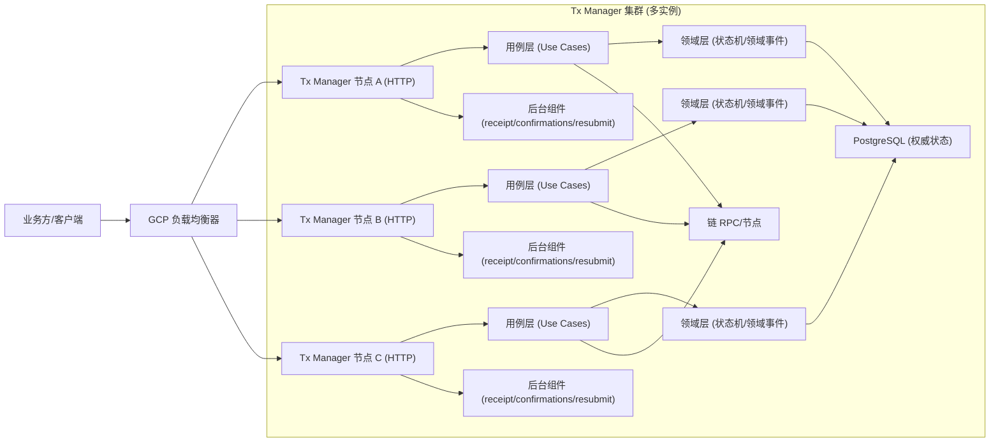
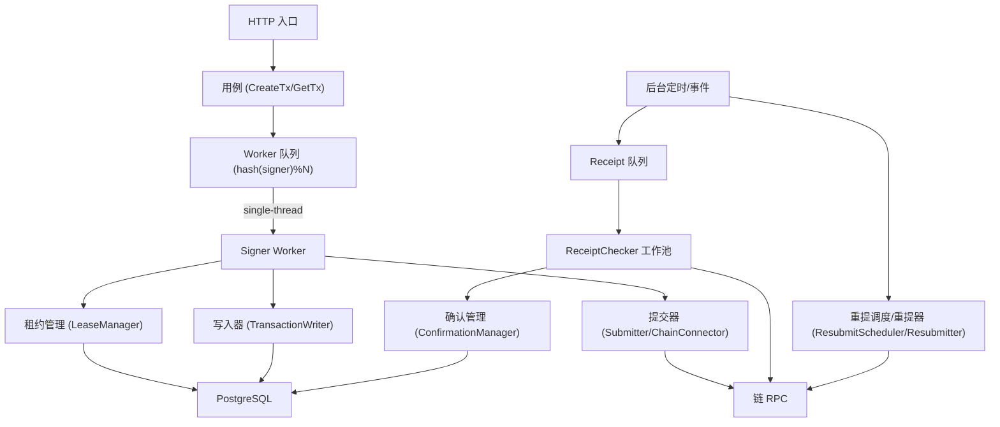
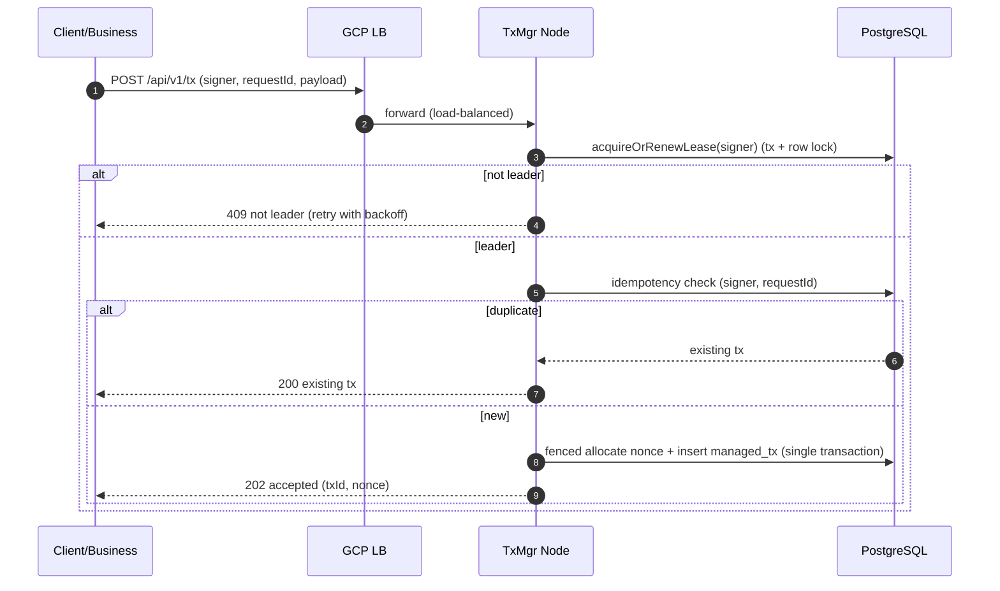
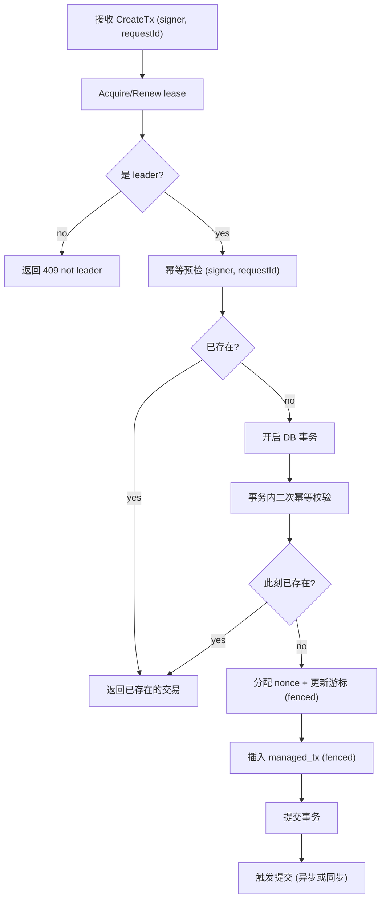
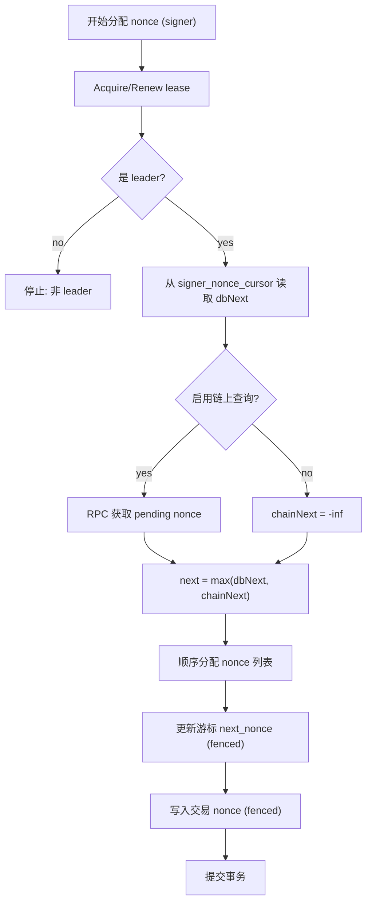
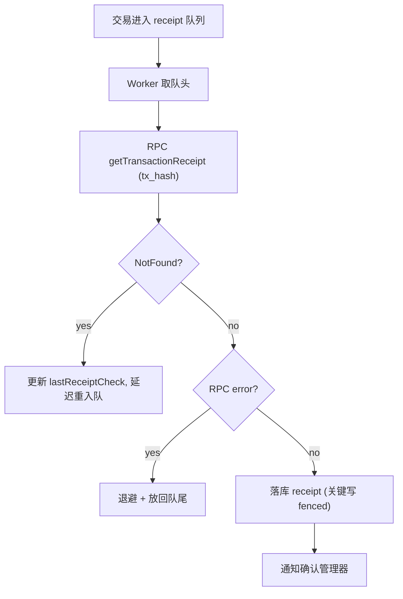
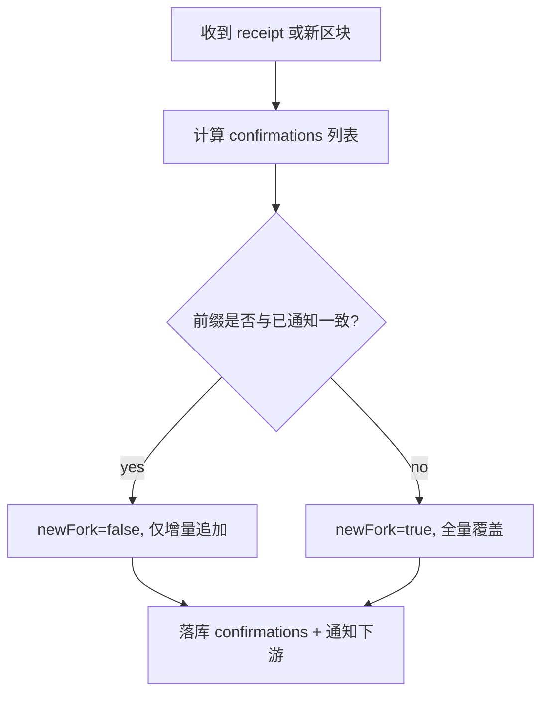
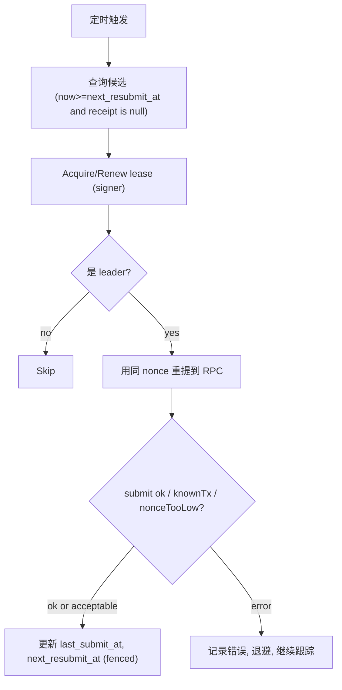

## 1. 目标与原则

### 1.1 目标

在多实例部署 (GCP Load Balancer 负责流量分发) 的前提下，为同一 signer 提供 **全局串行化的执行权**，确保：

- **nonce 不重复分配** (并发/故障切换/网络抖动下仍正确)
- **resubmit 不重复执行** (同 nonce 重提不会被多节点同时触发)
- **终局回写不被旧节点覆盖** (fencing 硬切断旧 owner 写入能力)
- **易维护、可独立演进**：与实际业务尽可能解耦，链/RPC/策略可插拔

### 1.2 核心原则（必须满足）

- **正确性只依赖“执行权层”**：GCP LB 的路由/粘性/重试不作为正确性依赖
- **同 signer 的关键写入必须 leader-only**：nonce 分配、状态推进、resubmit 调度、receipt/confirmations 的“最终回写”
- **fencing token 是硬约束**：所有关键写入必须携带 `fencing_token` 校验；旧 token 写入一律失败
- **异步推进终局**：提交与终局解耦；receipt/confirmations 由后台组件推进

### 1.3 非目标（本期不做/后续增强）

- Gas bump/替换交易策略（提供策略接口，默认简单实现）
- Mempool 诊断（仅做基础可观测性与保守重试）
- 多链多协议统一（先抽象接口，默认实现可先支持 EVM）

---

## 2. 总体架构（模块划分清晰、易维护）

### 2.1 分层与模块（推荐的工程结构）

为避免与具体业务强耦合，采用清晰分层 (可类比 Clean Architecture)：

- **API 层 (Inbound)**
  - `TxController`：接收创建/查询请求
  - `AdminController`：健康检查、调试端点 (可选)

- **应用层 (Application / Use Cases)**
  - `CreateTxUseCase`：幂等创建、触发分配与提交
  - `GetTxUseCase`：查询
  - `ResubmitScheduler`：扫描待重提交易并触发重提 (leader-only)

- **领域层 (Domain)**
  - `ManagedTx`：交易聚合根 (nonce、txHash、state)
  - `SignerLease`：租约与 fencing 语义
  - `TxStateMachine`：状态机（Created/Allocated/Tracking/Confirmed/Failed）
  - `DomainEvent`：领域事件 (TxCreated/TxSubmitted/TxReceiptUpdated/TxConfirmed 等)

- **基础设施层 (Infrastructure / Outbound Adapters)**
  - `LeaseRepository`：PostgreSQL 实现
  - `TxRepository`：PostgreSQL 实现
  - `NonceCursorRepository`：PostgreSQL 实现
  - `ChainConnector`：链 RPC 适配 (接口 + 默认实现)
  - `ReceiptChecker`：后台 worker 拉 receipt
  - `ConfirmationManager`：确认数与 reorg/newFork 处理

> 业务侧只需要关心“提交交易请求/消费终局结果”，其余全由 Tx Manager 自演进。

### 2.2 整体执行架构图（Mermaid）



### 2.3 单节点内部执行架构（并发控制与可维护性）



---

## 3. 权威数据模型 (PostgreSQL)

> 设计要点：lease/fencing 与交易状态必须可恢复且一致，因此权威状态落在 Postgres。

### 3.1 `signer_lease` (强制)

语义：同一 signer 同一时刻只有一个 owner；抢占时 `fencing_token` 单调递增。

```sql
CREATE TABLE IF NOT EXISTS signer_lease (
  signer         TEXT PRIMARY KEY,
  owner_node     TEXT NOT NULL,
  fencing_token  BIGINT NOT NULL,
  expires_at     TIMESTAMPTZ NOT NULL,
  updated_at     TIMESTAMPTZ NOT NULL DEFAULT now()
);
CREATE INDEX IF NOT EXISTS idx_signer_lease_owner_node ON signer_lease(owner_node);
```

### 3.2 `managed_tx` (建议：交易即 nonce 载体)

语义：nonce 一旦分配写入交易记录，并通过状态机推进到终局。

```sql
CREATE TABLE IF NOT EXISTS managed_tx (
  tx_id            UUID PRIMARY KEY,
  signer           TEXT NOT NULL,
  request_id       TEXT NULL,
  nonce            BIGINT NULL,
  payload          JSONB NOT NULL,
  tx_hash          TEXT NULL,
  state            TEXT NOT NULL,
  sub_state        TEXT NULL,
  last_submit_at   TIMESTAMPTZ NULL,
  next_resubmit_at TIMESTAMPTZ NULL,
  receipt          JSONB NULL,
  confirmations    JSONB NULL,
  confirmed_at     TIMESTAMPTZ NULL,
  fencing_token    BIGINT NULL,
  created_at       TIMESTAMPTZ NOT NULL DEFAULT now(),
  updated_at       TIMESTAMPTZ NOT NULL DEFAULT now()
);

CREATE UNIQUE INDEX IF NOT EXISTS uq_managed_tx_signer_request_id
  ON managed_tx(signer, request_id)
  WHERE request_id IS NOT NULL;

CREATE INDEX IF NOT EXISTS idx_managed_tx_signer_state_resubmit
  ON managed_tx(signer, state, next_resubmit_at);

CREATE INDEX IF NOT EXISTS idx_managed_tx_tx_hash
  ON managed_tx(tx_hash);
```

### 3.3 `signer_nonce_cursor` (建议)

语义：系统为每个 signer 维护 nextNonce 游标；写入必须 fenced。

```sql
CREATE TABLE IF NOT EXISTS signer_nonce_cursor (
  signer        TEXT PRIMARY KEY,
  next_nonce    BIGINT NOT NULL,
  fencing_token BIGINT NOT NULL,
  updated_at    TIMESTAMPTZ NOT NULL DEFAULT now()
);
```

---

## 4. 执行权：Lease + Fencing (核心正确性)

### 4.1 租约参数 (配置化)

- `leaseDuration`: 10s（建议 5–30s）
- `renewInterval`: 3s（小于 duration/2）
- `clockSkewAllowance`: 1s（用于保守判断过期）

### 4.2 抢占/续租算法 (事务 + 行级锁)


### 4.3 fenced 写入规则 (必须)

所有关键写入 (nonce 分配、txHash 写入、状态推进、resubmit 调度、receipt/confirmations 回写) 必须 fenced：

```sql
UPDATE managed_tx
SET state = :new_state,
    updated_at = now(),
    fencing_token = :token
WHERE tx_id = :tx_id
  AND signer = :signer
  AND EXISTS (
    SELECT 1
    FROM signer_lease sl
    WHERE sl.signer = :signer
      AND sl.owner_node = :node_id
      AND sl.expires_at > now()
      AND sl.fencing_token = :token
  );
```

约定：

- 影响行数为 0 => **FENCED** (旧 owner/过期 token)，必须停止该 signer 的处理并等待下一次抢租/下一次请求触发

---

## 5. 节点内并发模型 (易维护、可扩展)

### 5.1 为什么仍需要节点内串行

LB 会把同 signer 的请求打到不同节点/不同线程；正确性由 lease 保证，但为了性能与可控性：

- 同 signer 的操作建议在单节点内部串行 (减少 DB 冲突、便于批处理)
- 用固定数量 worker，按 `hash(signer)%N` 分配（稳定、可控、易扩展）

### 5.2 Worker 责任边界

`Signer Worker` 只负责：

- 抢租（LeaseManager）
- 幂等检查与写库（TransactionWriter）
- 提交与状态推进（Submitter）

后台模块（Receipt/Confirmations/Resubmit）可以独立演进与扩容，不污染主链路。

---

## 6. 核心流程 (每个细节点都有可执行流程图)

### 6.1 创建交易 (幂等 + leader-only nonce 分配)

#### 6.1.1 时序图



#### 6.1.2 CreateTx 流程图 (落地约束明确)



### 6.2 Nonce 分配策略 (max(chain, db/cache))

> 若 signer 可能被外部系统使用，必须定期参考链上 `pending nonce`；否则可主要依赖 DB 游标。



### 6.3 提交交易 (Submitter，幂等语义)

关键语义（参考 FFTM）：

- 提交成功：写 `tx_hash`，进入 `TRACKING`
- 提交失败但错误属于 `known_transaction` / `nonce_too_low`：
  - 若本地已有 `tx_hash`：视为幂等成功
  - 若本地无 `tx_hash`：灰区（需补偿能力：重算预期 txHash 或链上对账补齐）

### 6.4 ReceiptChecker（异步拉取，不阻塞主路径）



### 6.5 ConfirmationManager（确认数 + reorg + newFork）

newFork 协议（面向下游幂等与覆盖更新）：

- 若 confirmations 前缀 hash 不一致 => `newFork=true`，下游 **全量覆盖**
- 否则增量追加



### 6.6 Resubmitter（同 nonce 重提，leader-only）

触发条件（配置化）：

- `now - last_submit_at > resubmit_interval`
- 且 receipt 仍为空（或未达到终局）
- 且 `now >= next_resubmit_at`（防重复调度）



---

## 7. 故障与竞态场景（必测）

### 7.1 故障切换窗口（旧节点仍在跑）

目标：旧节点不得再写入关键状态；fencing 必须硬切断。

- 节点 A 持有 lease(token=10)
- 节点 B 抢占 lease(token=11)
- A 继续尝试写入关键状态 => fenced 更新 0 行，A 进入 FENCED 处理分支

### 7.2 网络分区

- 无法访问 DB 的节点无法续租 => lease 过期后失权
- 即使仍在跑，关键写入均 fenced 失败

### 7.3 重启恢复

- 状态机与游标在 DB 中可恢复
- `nonceStateTimeout` 越小越保守（更频繁参考链上 pending nonce）

---

## 8. 对外接口与业务解耦（可独立演进）

### 8.1 API（示例）

- `POST /api/v1/tx`：创建交易（建议强制 requestId）
- `GET /api/v1/tx/{txId}`：查询交易
- `GET /api/v1/tx/by-request?signer=...&requestId=...`：幂等查询

### 8.2 领域事件与回调（与业务解耦的推荐方式）

Tx Manager 对外只暴露稳定的“事件/回调协议”，业务侧无需理解 nonce/receipt/reorg 细节：

- `TxAccepted(txId, signer, nonce)`
- `TxSubmitted(txId, txHash)`
- `TxReceiptUpdated(txId, blockNumber, status)`
- `TxConfirmed(txId, confirmations, newFork)`
- `TxFailed(txId, reason)`

实现方式可选：

- HTTP webhook
- 消息队列（Kafka/PubSub）
- 业务主动轮询查询接口（最简单）

---

## 9. 配置项（建议）

- `lease.duration=10s`
- `lease.renewInterval=3s`
- `nonce.chainQuery.enabled=true`
- `nonce.chainQuery.mode=pending`
- `nonce.nonceStateTimeout=30s`
- `resubmit.enabled=true`
- `resubmit.interval=60s`
- `confirmations.required=20`
- `confirmations.staleReceiptTimeout=60s`
- `confirmations.receiptWorkers=10`

---

## 10. 可观测性（最低要求）

- **日志**：每次关键写入输出 `signer, txId, nodeId, fencingToken`
- **指标**
  - `lease_acquire_total{result}`
  - `lease_fenced_total`
  - `tx_create_total{result}`
  - `tx_submit_total{result}`
  - `receipt_check_total{result}`
  - `confirmations_newFork_total`
- **告警**
  - fenced 激增
  - receipt backlog 持续增长
  - resubmit 频率异常（可能 RPC 不稳定或链拥堵）

---

## 11. 测试用例（验收标准）

- **幂等**：同 `(signer, requestId)` 并发 100 次，只生成 1 条 `managed_tx`
- **并发**：单 signer 并发 1000 笔创建，nonce 严格递增无重复
- **双活窗口**：A->B 抢占后，A 的关键写全部 fenced 失败，B 可继续推进到终局
- **reorg/newFork**：触发前缀不一致时，下游收到 `newFork=true` 且 confirmations 全量覆盖

---

## 12. 后续增强方向（可选）

> 仅列“对维护与吞吐有明确收益、且不改变正确性边界”的项。

- **批处理 TransactionWriter（强推荐）**：合并同 signer 的 insert/update/receipt/confirmations/history 到一个 DB 批次事务，降低往返与锁竞争
- **Redis 作为非权威能力（可选）**：缓存 next_nonce（事务失败要清理）、receipt/resubmit 队列与延迟调度索引（降 DB 压力）
